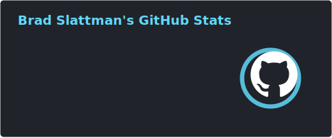
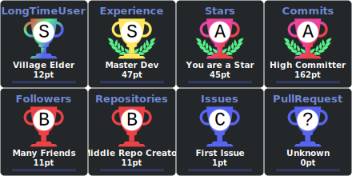

  

  
  &nbsp;
  
  
  &nbsp;
  
  

  

  

 ✨ [Assembly](#-assembly) ✨ [Astro](#-astro) ✨ [C](#-c) ✨ [C++](#-c++) ✨ [CSS](#-css) ✨ [Dockerfile](#-dockerfile) ✨ [Go](#-go) ✨ [HTML](#-html) ✨ [Java](#-java) ✨ [JavaScript](#-javascript) ✨ [Jupyter Notebook](#-jupyter-notebook) ✨ [PHP](#-php) ✨ [Python](#-python) ✨ [SCSS](#-scss) ✨ [Shell](#-shell) ✨ [Solidity](#-solidity) ✨ [Starlark](#-starlark) ✨ [TypeScript](#-typescript) ✨ [Vue](#-vue) ✨ [WebAssembly](#-webassembly)

## ✨ -

 - [FavioVazquez/ds-cheatsheets](https://github.com/FavioVazquez/ds-cheatsheets) - List of Data Science Cheatsheets to rule the world - *last updated on Thu Jan 02 2025*
 - [algomatic-inc/awesome-ai-agents-guide](https://github.com/algomatic-inc/awesome-ai-agents-guide) - 🤖 A collection of AI agents includes research papers, blogs, and products focused on developing autonomous systems. - *last updated on Thu Dec 19 2024*
 - [trimstray/the-book-of-secret-knowledge](https://github.com/trimstray/the-book-of-secret-knowledge) - A collection of inspiring lists, manuals, cheatsheets, blogs, hacks, one-liners, cli/web tools and more. - *last updated on Fri Jan 03 2025*
 - [TheSpeedX/PROXY-List](https://github.com/TheSpeedX/PROXY-List) - Get PROXY List  that gets updated everyday - *last updated on Fri Jan 03 2025*
 - [akr3ch/BugBountyBooks](https://github.com/akr3ch/BugBountyBooks) - A collection of PDF/books about the modern web application security and bug bounty. - *last updated on Thu Jan 02 2025*
 - [nrwl/workshop-nx-labs](https://github.com/nrwl/workshop-nx-labs) - Lab exercises for the Nx Enterprise workshop(s) - *last updated on Sun Apr 14 2024*

## ✨ Assembly

 - [janroesner/sixty5o2](https://github.com/janroesner/sixty5o2) - Micro Kernel / Bootloader for Ben Eater's 6502 Computer - *last updated on Thu Dec 19 2024*

## ✨ Astro

 - [cameronapak/freedom-stack](https://github.com/cameronapak/freedom-stack) - A full-stack Astro starter kit that feels freeing and is free. Ready for use, and even better when using Cursor's IDE. - *last updated on Mon Dec 30 2024*

## ✨ C

 - [therealsaumil/static-arm-bins](https://github.com/therealsaumil/static-arm-bins) - Statically compiled ARM binaries for debugging and runtime analysis - *last updated on Thu Jan 02 2025*
 - [qemu/qemu](https://github.com/qemu/qemu) - Official QEMU mirror. Please see https://www.qemu.org/contribute/ for how to submit changes to QEMU. Pull Requests are ignored. Please only use release tarballs from the QEMU website. - *last updated on Fri Jan 03 2025*
 - [gitter-badger/modbusd](https://github.com/gitter-badger/modbusd) - Modbus master daemon based on libmodbus - *last updated on Fri Apr 29 2022*

## ✨ C++

 - [codeplaysoftware/cuda-to-sycl-nbody](https://github.com/codeplaysoftware/cuda-to-sycl-nbody) - undefined - *last updated on Thu Jan 02 2025*
 - [emscripten-core/emscripten](https://github.com/emscripten-core/emscripten) - Emscripten: An LLVM-to-WebAssembly Compiler - *last updated on Fri Jan 03 2025*
 - [uxlfoundation/oneapi-construction-kit](https://github.com/uxlfoundation/oneapi-construction-kit) - undefined - *last updated on Tue Dec 24 2024*

## ✨ CSS

 - [mrholek/CoreUI-AngularJS](https://github.com/mrholek/CoreUI-AngularJS) - CoreUI AngularJS is free AngularJS admin template based on Bootstrap 4 - *last updated on Wed Feb 28 2024*

## ✨ Dockerfile

 - [jessfraz/dockerfiles](https://github.com/jessfraz/dockerfiles) - Various Dockerfiles I use on the desktop and on servers. - *last updated on Fri Jan 03 2025*

## ✨ Go

 - [massnetorg/MassNet-miner](https://github.com/massnetorg/MassNet-miner) - MassNet-miner is a Golang implementation of MassNet full-node miner. - *last updated on Tue Dec 31 2024*
 - [gopasspw/gopass](https://github.com/gopasspw/gopass) - The slightly more awesome standard unix password manager for teams - *last updated on Fri Jan 03 2025*
 - [ollama/ollama](https://github.com/ollama/ollama) - Get up and running with Llama 3.3, Mistral, Gemma 2, and other large language models. - *last updated on Fri Jan 03 2025*
 - [danielmiessler/fabric](https://github.com/danielmiessler/fabric) - fabric is an open-source framework for augmenting humans using AI. It provides a modular framework for solving specific problems using a crowdsourced set of AI prompts that can be used anywhere. - *last updated on Fri Jan 03 2025*

## ✨ HTML

 - [sugarchain-project/web-wallet](https://github.com/sugarchain-project/web-wallet) - Simple web wallet - *last updated on Sat Dec 28 2024*
 - [MicroBitcoinOrg/microbitcoinorg.github.io](https://github.com/MicroBitcoinOrg/microbitcoinorg.github.io) - Home of MicroBitcoin - *last updated on Sat Dec 28 2024*
 - [irthomasthomas/undecidability](https://github.com/irthomasthomas/undecidability) - undefined - *last updated on Thu Jan 02 2025*

## ✨ Java

 - [CellularPrivacy/Android-IMSI-Catcher-Detector](https://github.com/CellularPrivacy/Android-IMSI-Catcher-Detector) - AIMSICD • Fight IMSI-Catcher, StingRay and silent SMS! - *last updated on Fri Jan 03 2025*

## ✨ JavaScript

 - [lowlighter/metrics](https://github.com/lowlighter/metrics) - 📊 An infographics generator with 30+ plugins and 300+ options to display stats about your GitHub account and render them as SVG, Markdown, PDF or JSON! - *last updated on Fri Jan 03 2025*
 - [DustinBrett/daedalOS](https://github.com/DustinBrett/daedalOS) - Desktop environment in the browser - *last updated on Fri Jan 03 2025*
 - [OutCast3k/coinbin](https://github.com/OutCast3k/coinbin) - Javascript Bitcoin Wallet. Supports Multisig, Stealth, HD, SegWit, Bech32, Time Locked Addresses, RBF and more! - *last updated on Tue Dec 31 2024*
 - [nodejs/node](https://github.com/nodejs/node) - Node.js JavaScript runtime ✨🐢🚀✨ - *last updated on Fri Jan 03 2025*
 - [open-webui/open-webui](https://github.com/open-webui/open-webui) - User-friendly AI Interface (Supports Ollama, OpenAI API, ...) - *last updated on Fri Jan 03 2025*
 - [LeCoupa/awesome-cheatsheets](https://github.com/LeCoupa/awesome-cheatsheets) - 👩‍💻👨‍💻 Awesome cheatsheets for popular programming languages, frameworks and development tools. They include everything you should know in one single file. - *last updated on Fri Jan 03 2025*
 - [vercel/next.js](https://github.com/vercel/next.js) - The React Framework - *last updated on Fri Jan 03 2025*
 - [webmachinelearning/webnn-samples](https://github.com/webmachinelearning/webnn-samples) - 🧠✨ Web Neural Network API samples - *last updated on Wed Jan 01 2025*
 - [PaulKinlan/idb-vector](https://github.com/PaulKinlan/idb-vector) - A simple vector database built on idb - *last updated on Mon Dec 30 2024*
 - [AshMartian/unofficial-sense](https://github.com/AshMartian/unofficial-sense) - NodeJS Unnoficial Sense API integration - *last updated on Sat Mar 04 2023*
 - [vercel/ncc](https://github.com/vercel/ncc) - Compile a Node.js project into a single file. Supports TypeScript, binary addons, dynamic requires. - *last updated on Fri Jan 03 2025*
 - [alyssaxuu/flowy](https://github.com/alyssaxuu/flowy) - The minimal javascript library to create flowcharts ✨ - *last updated on Thu Jan 02 2025*
 - [sveltejs/svelte](https://github.com/sveltejs/svelte) - web development for the rest of us - *last updated on Fri Jan 03 2025*
 - [khrome83/khrome.dev](https://github.com/khrome83/khrome.dev) - Public Website and Blog - *last updated on Fri Apr 12 2024*
 - [SocketCluster/socketcluster](https://github.com/SocketCluster/socketcluster) - Highly scalable realtime pub/sub and RPC framework - *last updated on Wed Jan 01 2025*
 - [Chabane/generator-mitosis](https://github.com/Chabane/generator-mitosis) - A micro-service infrastructure generator based on Yeoman/Chatbot, Kubernetes/Docker Swarm, Traefik, Ansible, Jenkins, Spark, Hadoop, Kafka, etc. - *last updated on Thu Aug 15 2024*
 - [OptimalBits/bull](https://github.com/OptimalBits/bull) - Premium Queue package for handling distributed jobs and messages in NodeJS. - *last updated on Fri Jan 03 2025*
 - [qiskit-community/qiskit-js](https://github.com/qiskit-community/qiskit-js) - :atom_symbol: Qiskit (Quantum Information Science Kit) for JavaScript - *last updated on Tue Nov 12 2024*
 - [stvbll/google-sheets-solaredge](https://github.com/stvbll/google-sheets-solaredge) - Collection of Google Sheets scripts for interacting with SolarEdge API - *last updated on Wed Jul 03 2024*
 - [alexanderbazo/SolarBoard](https://github.com/alexanderbazo/SolarBoard) - SolarBoard is a javascript dashboard for SolarEdge systems. - *last updated on Thu May 16 2024*
 - [quarkbyte/owl-fe](https://github.com/quarkbyte/owl-fe) - undefined - *last updated on Tue Oct 23 2018*
 - [jovermier/modbusIoT](https://github.com/jovermier/modbusIoT) - undefined - *last updated on Thu Jun 20 2024*
 - [nrwl/bazel-cli-build](https://github.com/nrwl/bazel-cli-build) - undefined - *last updated on Thu Mar 28 2024*
 - [pongiof/circly](https://github.com/pongiof/circly) - undefined - *last updated on Sun Feb 06 2022*

## ✨ Jupyter-Notebook

 - [bmild/nerf](https://github.com/bmild/nerf) - Code release for NeRF (Neural Radiance Fields) - *last updated on Fri Jan 03 2025*

## ✨ PHP

 - [danielmiessler/SecLists](https://github.com/danielmiessler/SecLists) - SecLists is the security tester's companion. It's a collection of multiple types of lists used during security assessments, collected in one place. List types include usernames, passwords, URLs, sensitive data patterns, fuzzing payloads, web shells, and many more. - *last updated on Fri Jan 03 2025*
 - [squizlabs/PHP_CodeSniffer](https://github.com/squizlabs/PHP_CodeSniffer) - PHP_CodeSniffer tokenizes PHP files and detects violations of a defined set of coding standards. - *last updated on Fri Jan 03 2025*
 - [PHPCompatibility/PHPCompatibility](https://github.com/PHPCompatibility/PHPCompatibility) - PHP Compatibility check for PHP_CodeSniffer - *last updated on Sun Dec 29 2024*

## ✨ Python

 - [tinyfish-io/agentql](https://github.com/tinyfish-io/agentql) - AgentQL is an AI-powered query language for web scraping and automation. It uses natural language selectors to find data on any page, including authenticated content. AgentQL queries are self-healing as UI changes and work across similar sites. Users can define structured data output, making AgentQL versatile for developers and data scientists. - *last updated on Fri Jan 03 2025*
 - [bks1242/ai-reflection-agent](https://github.com/bks1242/ai-reflection-agent) - undefined - *last updated on Thu Dec 19 2024*
 - [botextractai/ai-autogen-multi-agent](https://github.com/botextractai/ai-autogen-multi-agent) - AutoGen multi AI agent blog post writing using reflection - *last updated on Thu Jan 02 2025*
 - [unslothai/unsloth](https://github.com/unslothai/unsloth) - Finetune Llama 3.3, Mistral, Phi, Qwen 2.5 & Gemma LLMs 2-5x faster with 70% less memory - *last updated on Fri Jan 03 2025*
 - [OWASP/CheatSheetSeries](https://github.com/OWASP/CheatSheetSeries) - The OWASP Cheat Sheet Series was created to provide a concise collection of high value information on specific application security topics. - *last updated on Fri Jan 03 2025*
 - [intel-analytics/ipex-llm](https://github.com/intel-analytics/ipex-llm) - Accelerate local LLM inference and finetuning (LLaMA, Mistral, ChatGLM, Qwen, Mixtral, Gemma, Phi, MiniCPM, Qwen-VL, MiniCPM-V, etc.) on Intel XPU (e.g., local PC with iGPU and NPU, discrete GPU such as Arc, Flex and Max); seamlessly integrate with llama.cpp, Ollama, HuggingFace, LangChain, LlamaIndex, vLLM, GraphRAG, DeepSpeed, Axolotl, etc - *last updated on Fri Jan 03 2025*
 - [google/mipnerf](https://github.com/google/mipnerf) - undefined - *last updated on Wed Jan 01 2025*
 - [google-research/multinerf](https://github.com/google-research/multinerf) - A Code Release for Mip-NeRF 360, Ref-NeRF, and RawNeRF - *last updated on Fri Jan 03 2025*
 - [xai-org/grok-1](https://github.com/xai-org/grok-1) - Grok open release - *last updated on Fri Jan 03 2025*
 - [huggingface/transformers](https://github.com/huggingface/transformers) - 🤗 Transformers: State-of-the-art Machine Learning for Pytorch, TensorFlow, and JAX. - *last updated on Fri Jan 03 2025*
 - [openfaas/workshop](https://github.com/openfaas/workshop) - Learn Serverless for Kubernetes with OpenFaaS - *last updated on Mon Dec 09 2024*
 - [Toxicable/bazel-monorepo-example](https://github.com/Toxicable/bazel-monorepo-example) - undefined - *last updated on Thu Dec 16 2021*
 - [nrwl/nx-bazel-example](https://github.com/nrwl/nx-bazel-example) - undefined - *last updated on Mon Sep 30 2024*

## ✨ SCSS

 - [rstacruz/cheatsheets](https://github.com/rstacruz/cheatsheets) - Cheatsheets for web development - devhints.io - *last updated on Thu Jan 02 2025*

## ✨ Shell

 - [jessfraz/dotfiles](https://github.com/jessfraz/dotfiles) - My dotfiles. Buyer beware ;) - *last updated on Fri Jan 03 2025*
 - [ChristianLempa/dotfiles](https://github.com/ChristianLempa/dotfiles) - This contain my personal config files. Here you'll find configs, customizations, themes, and whatever I need to personalize my Linux and mac OS experience. - *last updated on Wed Jan 01 2025*
 - [arismelachroinos/lscript](https://github.com/arismelachroinos/lscript) - The LAZY script will make your life easier, and of course faster. - *last updated on Fri Jan 03 2025*

## ✨ Solidity

 - [Cyfrin/foundry-defi-stablecoin-cu](https://github.com/Cyfrin/foundry-defi-stablecoin-cu) - undefined - *last updated on Fri Jan 03 2025*

## ✨ Starlark

 - [GoogleContainerTools/base-images-docker](https://github.com/GoogleContainerTools/base-images-docker) - Base images for Google Docker containers. - *last updated on Sat Dec 28 2024*
 - [GoogleContainerTools/distroless](https://github.com/GoogleContainerTools/distroless) - 🥑  Language focused docker images, minus the operating system.   - *last updated on Fri Jan 03 2025*

## ✨ TypeScript

 - [vitejs/vite](https://github.com/vitejs/vite) - Next generation frontend tooling. It's fast! - *last updated on Fri Jan 03 2025*
 - [actions/starter-workflows](https://github.com/actions/starter-workflows) - Accelerating new GitHub Actions workflows  - *last updated on Fri Jan 03 2025*
 - [sendaifun/solana-agent-kit](https://github.com/sendaifun/solana-agent-kit) - connect any ai agents to solana protocols - *last updated on Fri Jan 03 2025*
 - [reown-com/web-examples](https://github.com/reown-com/web-examples) - Wallet and dapp examples implementing WalletConnect v2 - *last updated on Thu Jan 02 2025*
 - [withastro/astro](https://github.com/withastro/astro) - The web framework for content-driven websites. ⭐️ Star to support our work! - *last updated on Fri Jan 03 2025*
 - [lit/lit](https://github.com/lit/lit) - Lit is a simple library for building fast, lightweight web components. - *last updated on Fri Jan 03 2025*
 - [shoelace-style/shoelace](https://github.com/shoelace-style/shoelace) - A collection of professionally designed, every day UI components built on Web standards. SHOELACE IS BECOMING WEB AWESOME 👇👇👇 - *last updated on Fri Jan 03 2025*
 - [blakeblackshear/frigate](https://github.com/blakeblackshear/frigate) - NVR with realtime local object detection for IP cameras - *last updated on Fri Jan 03 2025*
 - [angular/components](https://github.com/angular/components) - Component infrastructure and Material Design components for Angular - *last updated on Fri Jan 03 2025*
 - [NativeScript/NativeScript](https://github.com/NativeScript/NativeScript) - ⚡ Empowering JavaScript with native platform APIs. ✨ Best of all worlds (TypeScript, Swift, Objective C, Kotlin, Java, Dart). Use what you love ❤️ Angular, Capacitor, Ionic, React, Solid, Svelte, Vue with: iOS (UIKit, SwiftUI), Android (View, Jetpack Compose), Dart (Flutter) and you name it compatible. - *last updated on Fri Jan 03 2025*
 - [OpenAPITools/openapi-generator-cli](https://github.com/OpenAPITools/openapi-generator-cli) - A node package wrapper for https://github.com/OpenAPITools/openapi-generator - *last updated on Thu Jan 02 2025*
 - [ollama/ollama-js](https://github.com/ollama/ollama-js) - Ollama JavaScript library - *last updated on Thu Jan 02 2025*
 - [langchain-ai/langchainjs](https://github.com/langchain-ai/langchainjs) - 🦜🔗 Build context-aware reasoning applications 🦜🔗 - *last updated on Fri Jan 03 2025*
 - [webgpu/webgpu-samples](https://github.com/webgpu/webgpu-samples) - WebGPU Samples - *last updated on Fri Jan 03 2025*
 - [vercel/examples](https://github.com/vercel/examples) - Enjoy our curated collection of examples and solutions. Use these patterns to build your own robust and scalable applications. - *last updated on Fri Jan 03 2025*
 - [pubkey/javascript-vector-database](https://github.com/pubkey/javascript-vector-database) - Local-First Vector Database with RxDB and transformers.js - *last updated on Thu Dec 19 2024*
 - [pubkey/rxdb](https://github.com/pubkey/rxdb) - A fast, local first, reactive Database for JavaScript Applications https://rxdb.info/ - *last updated on Fri Jan 03 2025*
 - [vercel/ai](https://github.com/vercel/ai) - Build AI-powered applications with React, Svelte, Vue, and Solid - *last updated on Fri Jan 03 2025*
 - [ng-be/app-ng-be-org](https://github.com/ng-be/app-ng-be-org) - The mobile application for NG-BE 2023 - *last updated on Wed Mar 01 2023*
 - [Qiskit/qiskit-code-assistant-vscode](https://github.com/Qiskit/qiskit-code-assistant-vscode) - A VSCode extension to use the Qiskit Code Assistant (Beta) - *last updated on Mon Dec 23 2024*
 - [xlayers/xlayers](https://github.com/xlayers/xlayers) - ✨ Generate code from your design - *last updated on Thu Nov 14 2024*
 - [angular/angular](https://github.com/angular/angular) - Deliver web apps with confidence 🚀 - *last updated on Fri Jan 03 2025*
 - [angular/angular-bazel-example](https://github.com/angular/angular-bazel-example) - MOVED to the bazel nodejs monorepo  👉 - *last updated on Wed Nov 06 2024*
 - [akveo/nebular](https://github.com/akveo/nebular) - :boom: Customizable Angular UI Library based on Eva Design System :new_moon_with_face::sparkles:Dark Mode - *last updated on Thu Jan 02 2025*

## ✨ Vue

 - [rpadovani/daintree](https://github.com/rpadovani/daintree) - An open source alternative to the AWS Console! - *last updated on Tue Oct 29 2024*

## ✨ WebAssembly

 - [AssemblyScript/examples](https://github.com/AssemblyScript/examples) - A collection of AssemblyScript examples. - *last updated on Sun Dec 22 2024*
 - [mdn/webassembly-examples](https://github.com/mdn/webassembly-examples) - Code examples that accompany the MDN WebAssembly documentation — see https://developer.mozilla.org/en-US/docs/WebAssembly.  - *last updated on Fri Jan 03 2025*