  

  
  &nbsp;
  
  
  &nbsp;
  
  

  

  

[📃](#--📃) ✨ [Assembly](#--assembly) ✨ [Astro](#--astro) ✨ [Bikeshed](#--bikeshed) ✨ [C](#--c) ✨ [C++](#--c++) ✨ [CSS](#--css) ✨ [Dockerfile](#--dockerfile) ✨ [Go](#--go) ✨ [Haskell](#--haskell) ✨ [HCL](#--hcl) ✨ [HTML](#--html) ✨ [Java](#--java) ✨ [JavaScript](#--javascript) ✨ [Jupyter Notebook](#--jupyter-notebook) ✨ [LLVM](#--llvm) ✨ [Markdown](#--markdown) ✨ [OCaml](#--ocaml) ✨ [PHP](#--php) ✨ [Python](#--python) ✨ [Rust](#--rust) ✨ [SCSS](#--scss) ✨ [Shell](#--shell) ✨ [Smarty](#--smarty) ✨ [Solidity](#--solidity) ✨ [Starlark](#--starlark) ✨ [Svelte](#--svelte) ✨ [TypeScript](#--typescript) ✨ [Vue](#--vue) ✨ [WebAssembly](#--webassembly)

## [🔝 ✨ 📃](#to-the-top)

 - [wbkd/awesome-d3](https://github.com/wbkd/awesome-d3) - A list of D3 libraries, plugins and utilities - *[ [charts](https://github.com/topics/charts), [d3js](https://github.com/topics/d3js), [datavisualization](https://github.com/topics/datavisualization), [javascript](https://github.com/topics/javascript), [maps](https://github.com/topics/maps) ]* - *last updated on Nov 25, 2025 @ 10:47:01 AM*
 - [hal9ai/awesome-dataviz](https://github.com/hal9ai/awesome-dataviz) - :chart_with_upwards_trend:  A curated list of awesome data visualization libraries and resources. - *[ [awesome-list](https://github.com/topics/awesome-list), [chart](https://github.com/topics/chart), [data-visualization](https://github.com/topics/data-visualization), [dataviz](https://github.com/topics/dataviz), [visualization](https://github.com/topics/visualization), [visualize-data](https://github.com/topics/visualize-data) ]* - *last updated on Nov 26, 2025 @ 4:15:04 PM*
 - [punkpeye/awesome-mcp-servers](https://github.com/punkpeye/awesome-mcp-servers) - A collection of MCP servers. - *[ [ai](https://github.com/topics/ai), [mcp](https://github.com/topics/mcp) ]* - *last updated on Nov 29, 2025 @ 11:56:51 PM*
 - [web-padawan/awesome-lit](https://github.com/web-padawan/awesome-lit) - A curated list of awesome Lit resources. - *[ [awesome](https://github.com/topics/awesome), [awesome-list](https://github.com/topics/awesome-list), [lit-html](https://github.com/topics/lit-html) ]* - *last updated on Nov 28, 2025 @ 4:03:50 PM*
 - [Zjh-819/LLMDataHub](https://github.com/Zjh-819/LLMDataHub) - A quick guide (especially) for trending instruction finetuning datasets  - *[ [chatbot](https://github.com/topics/chatbot), [chatgpt](https://github.com/topics/chatgpt), [dataset](https://github.com/topics/dataset), [llm](https://github.com/topics/llm) ]* - *last updated on Nov 28, 2025 @ 4:59:47 PM*
 - [trusktr/WebGL-WebGPU-frameworks-libraries](https://github.com/trusktr/WebGL-WebGPU-frameworks-libraries) - A list WebGL/WebGPU/WebXR of libraries and frameworks. - *[ ]* - *last updated on Oct 6, 2025 @ 9:23:16 AM*
 - [Corsinvest/awesome-proxmox-ve](https://github.com/Corsinvest/awesome-proxmox-ve) - A collection of awesome Proxmox VE documentation, tools, api, blogs, site - *[ [article](https://github.com/topics/article), [awesome](https://github.com/topics/awesome), [awesome-list](https://github.com/topics/awesome-list), [proxmox](https://github.com/topics/proxmox), [proxmox-api](https://github.com/topics/proxmox-api), [proxmox-ve](https://github.com/topics/proxmox-ve), [proxmox-virtualization](https://github.com/topics/proxmox-virtualization), [proxmoxve](https://github.com/topics/proxmoxve) ]* - *last updated on Nov 29, 2025 @ 4:42:25 AM*
 - [2-fly-4-ai/V0-system-prompt](https://github.com/2-fly-4-ai/V0-system-prompt) - undefined - *[ ]* - *last updated on Nov 26, 2025 @ 11:34:16 AM*
 - [FavioVazquez/ds-cheatsheets](https://github.com/FavioVazquez/ds-cheatsheets) - List of Data Science Cheatsheets to rule the world - *[ [cheatsheet](https://github.com/topics/cheatsheet), [datascience](https://github.com/topics/datascience), [jupyter](https://github.com/topics/jupyter), [programming](https://github.com/topics/programming), [python](https://github.com/topics/python), [r](https://github.com/topics/r), [spark](https://github.com/topics/spark) ]* - *last updated on Nov 29, 2025 @ 10:37:03 PM*
 - [trimstray/the-book-of-secret-knowledge](https://github.com/trimstray/the-book-of-secret-knowledge) - A collection of inspiring lists, manuals, cheatsheets, blogs, hacks, one-liners, cli/web tools and more. - *[ [awesome](https://github.com/topics/awesome), [awesome-list](https://github.com/topics/awesome-list), [bsd](https://github.com/topics/bsd), [cheatsheets](https://github.com/topics/cheatsheets), [devops](https://github.com/topics/devops), [guidelines](https://github.com/topics/guidelines), [hacking](https://github.com/topics/hacking), [hacks](https://github.com/topics/hacks), [howtos](https://github.com/topics/howtos), [linux](https://github.com/topics/linux), [lists](https://github.com/topics/lists), [manuals](https://github.com/topics/manuals), [one-liners](https://github.com/topics/one-liners), [pentesters](https://github.com/topics/pentesters), [resources](https://github.com/topics/resources), [search-engines](https://github.com/topics/search-engines), [security](https://github.com/topics/security), [security-researchers](https://github.com/topics/security-researchers), [sysops](https://github.com/topics/sysops) ]* - *last updated on Nov 30, 2025 @ 12:16:29 AM*
 - [TheSpeedX/PROXY-List](https://github.com/TheSpeedX/PROXY-List) - Get PROXY List  that gets updated everyday - *[ [anonymity](https://github.com/topics/anonymity), [anonymous](https://github.com/topics/anonymous), [elite](https://github.com/topics/elite), [free](https://github.com/topics/free), [free-proxy](https://github.com/topics/free-proxy), [hacking](https://github.com/topics/hacking), [http](https://github.com/topics/http), [https-proxy](https://github.com/topics/https-proxy), [proxy](https://github.com/topics/proxy), [proxy-list](https://github.com/topics/proxy-list), [socker](https://github.com/topics/socker), [socks](https://github.com/topics/socks), [socks-proxy](https://github.com/topics/socks-proxy), [socks4-proxy](https://github.com/topics/socks4-proxy), [socks5-proxy](https://github.com/topics/socks5-proxy), [speedx](https://github.com/topics/speedx), [vpn](https://github.com/topics/vpn) ]* - *last updated on Nov 29, 2025 @ 9:15:23 PM*
 - [akr3ch/BugBountyBooks](https://github.com/akr3ch/BugBountyBooks) - A collection of PDF/books about the modern web application security and bug bounty. - *[ [bugbounty](https://github.com/topics/bugbounty), [bugbountybooks](https://github.com/topics/bugbountybooks), [bugbountypdf](https://github.com/topics/bugbountypdf), [bugbountytips](https://github.com/topics/bugbountytips), [cheatsheets](https://github.com/topics/cheatsheets), [hackingbooks](https://github.com/topics/hackingbooks) ]* - *last updated on Nov 29, 2025 @ 4:38:53 AM*
 - [nrwl/workshop-nx-labs](https://github.com/nrwl/workshop-nx-labs) - Lab exercises for the Nx Enterprise workshop(s) - *[ ]* - *last updated on Apr 14, 2024 @ 10:34:21 AM*

## [🔝 ✨ Assembly](#to-the-top)

 - [janroesner/sixty5o2](https://github.com/janroesner/sixty5o2) - Micro Kernel / Bootloader for Ben Eater's 6502 Computer - *[ ]* - *last updated on Nov 29, 2025 @ 12:47:15 PM*

## [🔝 ✨ Astro](#to-the-top)

 - [cameronapak/freedom-stack](https://github.com/cameronapak/freedom-stack) - A full-stack Astro starter kit that feels freeing and is free. Ready for use, and even better when using Cursor's IDE. - *[ [alpinejs](https://github.com/topics/alpinejs), [astro](https://github.com/topics/astro), [astro-db](https://github.com/topics/astro-db), [astrojs](https://github.com/topics/astrojs), [astrojs-boilerplate](https://github.com/topics/astrojs-boilerplate), [astrojs-template](https://github.com/topics/astrojs-template), [full-stack](https://github.com/topics/full-stack), [htmx](https://github.com/topics/htmx), [libsql](https://github.com/topics/libsql), [saas-boilerplate](https://github.com/topics/saas-boilerplate), [saas-starter-kit](https://github.com/topics/saas-starter-kit), [turso](https://github.com/topics/turso) ]* - *last updated on Nov 10, 2025 @ 10:31:40 AM*

## [🔝 ✨ Bikeshed](#to-the-top)

 - [immersive-web/WebXR-WebGPU-Binding](https://github.com/immersive-web/WebXR-WebGPU-Binding) - undefined - *[ [incubation](https://github.com/topics/incubation), [webxr](https://github.com/topics/webxr) ]* - *last updated on Jul 14, 2025 @ 10:41:21 AM*

## [🔝 ✨ C](#to-the-top)

 - [ffmpegwasm/ffmpeg.wasm](https://github.com/ffmpegwasm/ffmpeg.wasm) - FFmpeg for browser, powered by WebAssembly - *[ [audio](https://github.com/topics/audio), [experimental-features](https://github.com/topics/experimental-features), [ffmpeg](https://github.com/topics/ffmpeg), [transcode](https://github.com/topics/transcode), [video](https://github.com/topics/video), [wasm](https://github.com/topics/wasm) ]* - *last updated on Nov 29, 2025 @ 8:32:35 PM*
 - [php/php-src](https://github.com/php/php-src) - The PHP Interpreter - *[ ]* - *last updated on Nov 29, 2025 @ 11:07:06 PM*
 - [Yubico/yubico-piv-tool](https://github.com/Yubico/yubico-piv-tool) - Command line tool for the YubiKey PIV application - *[ [piv](https://github.com/topics/piv), [pkcs11](https://github.com/topics/pkcs11), [yubikey](https://github.com/topics/yubikey) ]* - *last updated on Nov 16, 2025 @ 4:40:58 PM*
 - [therealsaumil/static-arm-bins](https://github.com/therealsaumil/static-arm-bins) - Statically compiled ARM binaries for debugging and runtime analysis - *[ ]* - *last updated on Nov 25, 2025 @ 10:25:17 AM*
 - [qemu/qemu](https://github.com/qemu/qemu) - Official QEMU mirror. Please see https://www.qemu.org/contribute/ for how to submit changes to QEMU. Pull Requests are ignored. Please only use release tarballs from the QEMU website. - *[ [emulation](https://github.com/topics/emulation), [qemu](https://github.com/topics/qemu), [virtualization](https://github.com/topics/virtualization) ]* - *last updated on Nov 29, 2025 @ 6:03:50 PM*
 - [gitter-badger/modbusd](https://github.com/gitter-badger/modbusd) - Modbus master daemon based on libmodbus - *[ ]* - *last updated on Apr 29, 2022 @ 2:47:23 AM*

## [🔝 ✨ C++](#to-the-top)

 - [ggml-org/ggml](https://github.com/ggml-org/ggml) - Tensor library for machine learning - *[ [automatic-differentiation](https://github.com/topics/automatic-differentiation), [large-language-models](https://github.com/topics/large-language-models), [machine-learning](https://github.com/topics/machine-learning), [tensor-algebra](https://github.com/topics/tensor-algebra) ]* - *last updated on Nov 29, 2025 @ 5:05:40 PM*
 - [WasmEdge/WasmEdge](https://github.com/WasmEdge/WasmEdge) - WasmEdge is a lightweight, high-performance, and extensible WebAssembly runtime for cloud native, edge, and decentralized applications. It powers serverless apps, embedded functions, microservices, smart contracts, and IoT devices. - *[ [artificial-intelligence](https://github.com/topics/artificial-intelligence), [cloud](https://github.com/topics/cloud), [cloud-native](https://github.com/topics/cloud-native), [cncf](https://github.com/topics/cncf), [container](https://github.com/topics/container), [docker](https://github.com/topics/docker), [edge-computing](https://github.com/topics/edge-computing), [ewasm](https://github.com/topics/ewasm), [hacktoberfest](https://github.com/topics/hacktoberfest), [hacktoberfest2023](https://github.com/topics/hacktoberfest2023), [kubernetes](https://github.com/topics/kubernetes), [rust-lang](https://github.com/topics/rust-lang), [serverless](https://github.com/topics/serverless), [wasm](https://github.com/topics/wasm), [webassembly](https://github.com/topics/webassembly) ]* - *last updated on Nov 29, 2025 @ 7:36:07 PM*
 - [microsoft/onnxruntime](https://github.com/microsoft/onnxruntime) - ONNX Runtime: cross-platform, high performance ML inferencing and training accelerator - *[ [ai-framework](https://github.com/topics/ai-framework), [deep-learning](https://github.com/topics/deep-learning), [hardware-acceleration](https://github.com/topics/hardware-acceleration), [machine-learning](https://github.com/topics/machine-learning), [neural-networks](https://github.com/topics/neural-networks), [onnx](https://github.com/topics/onnx), [pytorch](https://github.com/topics/pytorch), [scikit-learn](https://github.com/topics/scikit-learn), [tensorflow](https://github.com/topics/tensorflow) ]* - *last updated on Nov 29, 2025 @ 11:11:26 PM*
 - [duckdb/duckdb-wasm](https://github.com/duckdb/duckdb-wasm) - WebAssembly version of DuckDB - *[ [analytics](https://github.com/topics/analytics), [browser](https://github.com/topics/browser), [database](https://github.com/topics/database), [javascript](https://github.com/topics/javascript), [node](https://github.com/topics/node), [olap](https://github.com/topics/olap), [sql](https://github.com/topics/sql), [typescript](https://github.com/topics/typescript), [webassembly](https://github.com/topics/webassembly) ]* - *last updated on Nov 28, 2025 @ 8:56:08 PM*
 - [codeplaysoftware/cuda-to-sycl-nbody](https://github.com/codeplaysoftware/cuda-to-sycl-nbody) - undefined - *[ ]* - *last updated on Feb 8, 2025 @ 7:08:02 PM*
 - [emscripten-core/emscripten](https://github.com/emscripten-core/emscripten) - Emscripten: An LLVM-to-WebAssembly Compiler - *[ [emscripten](https://github.com/topics/emscripten), [hacktoberfest](https://github.com/topics/hacktoberfest), [wasm](https://github.com/topics/wasm), [webassembly](https://github.com/topics/webassembly) ]* - *last updated on Nov 29, 2025 @ 7:27:49 PM*
 - [uxlfoundation/oneapi-construction-kit](https://github.com/uxlfoundation/oneapi-construction-kit) - undefined - *[ ]* - *last updated on Nov 10, 2025 @ 10:53:39 AM*

## [🔝 ✨ CSS](#to-the-top)

 - [mrholek/CoreUI-AngularJS](https://github.com/mrholek/CoreUI-AngularJS) - CoreUI AngularJS is free AngularJS admin template based on Bootstrap 4 - *[ [admin](https://github.com/topics/admin), [admin-dashboard](https://github.com/topics/admin-dashboard), [admin-panel](https://github.com/topics/admin-panel), [angularjs](https://github.com/topics/angularjs), [bootstrap](https://github.com/topics/bootstrap), [bootstrap-4](https://github.com/topics/bootstrap-4), [bootstrap-theme](https://github.com/topics/bootstrap-theme), [bootstrap4](https://github.com/topics/bootstrap4), [dashboard-templates](https://github.com/topics/dashboard-templates), [dashboards](https://github.com/topics/dashboards), [scss](https://github.com/topics/scss) ]* - *last updated on Mar 5, 2025 @ 3:32:04 AM*

## [🔝 ✨ Dockerfile](#to-the-top)

 - [lukechilds/dockerpi](https://github.com/lukechilds/dockerpi) - A Virtualised Raspberry Pi inside a Docker image - *[ [arm](https://github.com/topics/arm), [container](https://github.com/topics/container), [docker](https://github.com/topics/docker), [docker-image](https://github.com/topics/docker-image), [qemu](https://github.com/topics/qemu), [raspberry-pi](https://github.com/topics/raspberry-pi), [virtual-machine](https://github.com/topics/virtual-machine), [vm](https://github.com/topics/vm) ]* - *last updated on Nov 28, 2025 @ 7:55:37 AM*
 - [jessfraz/dockerfiles](https://github.com/jessfraz/dockerfiles) - Various Dockerfiles I use on the desktop and on servers. - *[ [bash](https://github.com/topics/bash), [containers](https://github.com/topics/containers), [docker](https://github.com/topics/docker), [dockerfile](https://github.com/topics/dockerfile), [dockerfiles](https://github.com/topics/dockerfiles), [linux](https://github.com/topics/linux), [shell](https://github.com/topics/shell) ]* - *last updated on Nov 29, 2025 @ 11:00:46 PM*

## [🔝 ✨ Go](#to-the-top)

 - [github/github-mcp-server](https://github.com/github/github-mcp-server) - GitHub's official MCP Server - *[ [github](https://github.com/topics/github), [mcp](https://github.com/topics/mcp), [mcp-server](https://github.com/topics/mcp-server) ]* - *last updated on Nov 29, 2025 @ 8:46:12 PM*
 - [opentofu/opentofu](https://github.com/opentofu/opentofu) - OpenTofu lets you declaratively manage your cloud infrastructure. - *[ ]* - *last updated on Nov 29, 2025 @ 8:52:30 PM*
 - [rancher/rke2](https://github.com/rancher/rke2) - undefined - *[ ]* - *last updated on Nov 29, 2025 @ 6:15:28 PM*
 - [hashicorp/terraform](https://github.com/hashicorp/terraform) - Terraform enables you to safely and predictably create, change, and improve infrastructure. It is a source-available tool that codifies APIs into declarative configuration files that can be shared amongst team members, treated as code, edited, reviewed, and versioned. - *[ [cloud](https://github.com/topics/cloud), [cloud-management](https://github.com/topics/cloud-management), [graph](https://github.com/topics/graph), [infrastructure-as-code](https://github.com/topics/infrastructure-as-code), [terraform](https://github.com/topics/terraform) ]* - *last updated on Nov 29, 2025 @ 5:55:50 PM*
 - [GoogleCloudPlatform/terraformer](https://github.com/GoogleCloudPlatform/terraformer) - CLI tool to generate terraform files from existing infrastructure (reverse Terraform). Infrastructure to Code - *[ [aws](https://github.com/topics/aws), [cloud](https://github.com/topics/cloud), [gcp](https://github.com/topics/gcp), [golang](https://github.com/topics/golang), [google-cloud](https://github.com/topics/google-cloud), [hcl](https://github.com/topics/hcl), [infrastructure-as-code](https://github.com/topics/infrastructure-as-code), [kubernetes](https://github.com/topics/kubernetes), [terraform](https://github.com/topics/terraform), [terraform-configurations](https://github.com/topics/terraform-configurations) ]* - *last updated on Nov 29, 2025 @ 7:51:41 PM*
 - [massnetorg/MassNet-miner](https://github.com/massnetorg/MassNet-miner) - MassNet-miner is a Golang implementation of MassNet full-node miner. - *[ ]* - *last updated on Dec 31, 2024 @ 11:45:27 PM*
 - [gopasspw/gopass](https://github.com/gopasspw/gopass) - The slightly more awesome standard unix password manager for teams - *[ [git](https://github.com/topics/git), [go](https://github.com/topics/go), [gpg](https://github.com/topics/gpg), [hacktoberfest](https://github.com/topics/hacktoberfest), [password-manager](https://github.com/topics/password-manager), [security](https://github.com/topics/security) ]* - *last updated on Nov 29, 2025 @ 7:14:52 PM*
 - [ollama/ollama](https://github.com/ollama/ollama) - Get up and running with OpenAI gpt-oss, DeepSeek-R1, Gemma 3 and other models. - *[ [deepseek](https://github.com/topics/deepseek), [gemma](https://github.com/topics/gemma), [gemma3](https://github.com/topics/gemma3), [gemma3n](https://github.com/topics/gemma3n), [go](https://github.com/topics/go), [golang](https://github.com/topics/golang), [gpt-oss](https://github.com/topics/gpt-oss), [llama](https://github.com/topics/llama), [llama2](https://github.com/topics/llama2), [llama3](https://github.com/topics/llama3), [llava](https://github.com/topics/llava), [llm](https://github.com/topics/llm), [llms](https://github.com/topics/llms), [mistral](https://github.com/topics/mistral), [ollama](https://github.com/topics/ollama), [phi4](https://github.com/topics/phi4), [qwen](https://github.com/topics/qwen) ]* - *last updated on Nov 30, 2025 @ 12:14:55 AM*

## [🔝 ✨ Haskell](#to-the-top)

 - [PostgREST/postgrest](https://github.com/PostgREST/postgrest) - REST API for any Postgres database - *[ [api](https://github.com/topics/api), [automatic-api](https://github.com/topics/automatic-api), [database](https://github.com/topics/database), [haskell](https://github.com/topics/haskell), [http](https://github.com/topics/http), [pg](https://github.com/topics/pg), [pgsql](https://github.com/topics/pgsql), [postgres](https://github.com/topics/postgres), [postgresql](https://github.com/topics/postgresql), [postgrest](https://github.com/topics/postgrest), [rest](https://github.com/topics/rest), [server](https://github.com/topics/server), [sql](https://github.com/topics/sql) ]* - *last updated on Nov 29, 2025 @ 11:17:05 PM*

## [🔝 ✨ HCL](#to-the-top)

 - [Azure/terraform](https://github.com/Azure/terraform) - Source code for the Azure Marketplace Terraform development VM package. - *[ ]* - *last updated on Nov 27, 2025 @ 2:15:08 PM*

## [🔝 ✨ HTML](#to-the-top)

 - [hannes-sistemica/browser-llm-webgpu](https://github.com/hannes-sistemica/browser-llm-webgpu) - Proof of concept for a reasoning model that runs locally in your browser with WebGPU acceleration - *[ [deepseek](https://github.com/topics/deepseek), [llm](https://github.com/topics/llm), [webgpu](https://github.com/topics/webgpu) ]* - *last updated on Nov 16, 2025 @ 8:36:15 PM*
 - [sugarchain-project/web-wallet](https://github.com/sugarchain-project/web-wallet) - Simple web wallet - *[ ]* - *last updated on Jun 26, 2025 @ 12:18:18 PM*
 - [MicroBitcoinOrg/microbitcoinorg.github.io](https://github.com/MicroBitcoinOrg/microbitcoinorg.github.io) - Home of MicroBitcoin - *[ ]* - *last updated on Jul 30, 2025 @ 6:58:32 AM*
 - [irthomasthomas/undecidability](https://github.com/irthomasthomas/undecidability) - undefined - *[ ]* - *last updated on Nov 15, 2025 @ 9:39:38 PM*

## [🔝 ✨ Java](#to-the-top)

 - [apache/druid](https://github.com/apache/druid) - Apache Druid: a high performance real-time analytics database. - *[ [druid](https://github.com/topics/druid) ]* - *last updated on Nov 29, 2025 @ 6:27:29 AM*
 - [CellularPrivacy/Android-IMSI-Catcher-Detector](https://github.com/CellularPrivacy/Android-IMSI-Catcher-Detector) - AIMSICD • Fight IMSI-Catcher, StingRay and silent SMS! - *[ [android](https://github.com/topics/android) ]* - *last updated on Nov 29, 2025 @ 7:31:28 PM*

## [🔝 ✨ JavaScript](#to-the-top)

 - [WikimapsAtlas/WikimapsAtlas-generator](https://github.com/WikimapsAtlas/WikimapsAtlas-generator) - A command line utility to convert heavy GIS sources into elegant administrative & topographic topojson files, raster files, and web friendly svg maps. - *[ ]* - *last updated on Apr 16, 2025 @ 7:07:56 PM*
 - [Leaflet/Leaflet](https://github.com/Leaflet/Leaflet) - 🍃 JavaScript library for mobile-friendly interactive maps 🇺🇦 - *[ [javascript](https://github.com/topics/javascript), [leaflet](https://github.com/topics/leaflet), [maps](https://github.com/topics/maps) ]* - *last updated on Nov 29, 2025 @ 9:12:20 PM*
 - [Free-APIs/Free-APIs.github.io](https://github.com/Free-APIs/Free-APIs.github.io) - A collection of free APIs for new and experienced developers - *[ [api](https://github.com/topics/api), [categories](https://github.com/topics/categories), [development](https://github.com/topics/development), [free](https://github.com/topics/free), [free-apis](https://github.com/topics/free-apis), [list](https://github.com/topics/list), [public](https://github.com/topics/public), [public-apis](https://github.com/topics/public-apis), [react](https://github.com/topics/react), [software](https://github.com/topics/software) ]* - *last updated on Nov 29, 2025 @ 5:16:18 PM*
 - [mozilla-spidermonkey/sm-wasi-demo](https://github.com/mozilla-spidermonkey/sm-wasi-demo) - Online SpiderMonkey WASI shell - *[ ]* - *last updated on Nov 29, 2025 @ 11:01:49 AM*
 - [haraka/Haraka](https://github.com/haraka/Haraka) - A fast, highly extensible, and event driven SMTP server - *[ [dkim](https://github.com/topics/dkim), [haraka](https://github.com/topics/haraka), [javascript](https://github.com/topics/javascript), [mta](https://github.com/topics/mta), [nodejs](https://github.com/topics/nodejs), [smtp](https://github.com/topics/smtp), [spf](https://github.com/topics/spf) ]* - *last updated on Nov 29, 2025 @ 5:30:30 AM*
 - [vitejs/awesome-vite](https://github.com/vitejs/awesome-vite) - ⚡️ A curated list of awesome things related to Vite.js - *[ [awesome](https://github.com/topics/awesome), [awesome-list](https://github.com/topics/awesome-list), [vite](https://github.com/topics/vite), [vitejs](https://github.com/topics/vitejs) ]* - *last updated on Nov 29, 2025 @ 10:29:55 PM*
 - [anuraghazra/github-readme-stats](https://github.com/anuraghazra/github-readme-stats) - :zap: Dynamically generated stats for your github readmes - *[ [dynamic](https://github.com/topics/dynamic), [profile-readme](https://github.com/topics/profile-readme), [readme-generator](https://github.com/topics/readme-generator), [readme-stats](https://github.com/topics/readme-stats), [serverless](https://github.com/topics/serverless) ]* - *last updated on Nov 29, 2025 @ 10:13:50 PM*
 - [skyfe79/awesome-readme-generator](https://github.com/skyfe79/awesome-readme-generator) - Generate Awesome Readme.md from your Github starred repos ;) - *[ [actions](https://github.com/topics/actions) ]* - *last updated on Mar 20, 2025 @ 6:00:26 AM*
 - [DaveSimoes/VercelZero](https://github.com/DaveSimoes/VercelZero) - A contemporary rebuild of Vercel’s original V0 platform, developed with Next.js, TypeScript, and powered by OpenAI GPT-4. - *[ [clone-app](https://github.com/topics/clone-app), [clone-copilot](https://github.com/topics/clone-copilot), [clone-copilot-nextjs](https://github.com/topics/clone-copilot-nextjs), [co-pilot](https://github.com/topics/co-pilot), [copilot](https://github.com/topics/copilot), [copilotkit](https://github.com/topics/copilotkit), [gpt-4o](https://github.com/topics/gpt-4o), [ia](https://github.com/topics/ia), [nextjs](https://github.com/topics/nextjs), [openai](https://github.com/topics/openai), [portfolio-project](https://github.com/topics/portfolio-project), [project-portfolio](https://github.com/topics/project-portfolio), [typescript](https://github.com/topics/typescript), [v0](https://github.com/topics/v0), [v0-clone](https://github.com/topics/v0-clone), [vercel](https://github.com/topics/vercel), [vercel-ai](https://github.com/topics/vercel-ai), [vercel-deployment](https://github.com/topics/vercel-deployment), [vercel-plataform](https://github.com/topics/vercel-plataform) ]* - *last updated on Nov 24, 2025 @ 10:13:36 AM*
 - [badges/shields](https://github.com/badges/shields) - Concise, consistent, and legible badges in SVG and raster format - *[ [badge](https://github.com/topics/badge), [badge-maker](https://github.com/topics/badge-maker), [github](https://github.com/topics/github), [hacktoberfest](https://github.com/topics/hacktoberfest), [metadata](https://github.com/topics/metadata), [status](https://github.com/topics/status), [svg](https://github.com/topics/svg) ]* - *last updated on Nov 29, 2025 @ 9:41:29 PM*
 - [lowlighter/metrics](https://github.com/lowlighter/metrics) - 📊 An infographics generator with 30+ plugins and 300+ options to display stats about your GitHub account and render them as SVG, Markdown, PDF or JSON! - *[ [automated](https://github.com/topics/automated), [automation](https://github.com/topics/automation), [github](https://github.com/topics/github), [github-action](https://github.com/topics/github-action), [github-api](https://github.com/topics/github-api), [github-metrics](https://github.com/topics/github-metrics), [github-profile](https://github.com/topics/github-profile), [javascript](https://github.com/topics/javascript), [metrics](https://github.com/topics/metrics), [profile](https://github.com/topics/profile), [profile-card](https://github.com/topics/profile-card), [profile-readme](https://github.com/topics/profile-readme), [readme](https://github.com/topics/readme), [readme-generator](https://github.com/topics/readme-generator), [readme-profile](https://github.com/topics/readme-profile), [svg-image](https://github.com/topics/svg-image) ]* - *last updated on Nov 29, 2025 @ 5:11:42 PM*
 - [DustinBrett/daedalOS](https://github.com/DustinBrett/daedalOS) - Desktop environment in the browser - *[ [desktop-environment](https://github.com/topics/desktop-environment), [javascript](https://github.com/topics/javascript), [os](https://github.com/topics/os), [web-desktop](https://github.com/topics/web-desktop) ]* - *last updated on Nov 29, 2025 @ 10:06:50 PM*
 - [OutCast3k/coinbin](https://github.com/OutCast3k/coinbin) - Javascript Bitcoin Wallet. Supports Multisig, Stealth, HD, SegWit, Bech32, Time Locked Addresses, RBF and more! - *[ [bech32](https://github.com/topics/bech32), [bitcoin](https://github.com/topics/bitcoin), [bitcoin-wallet](https://github.com/topics/bitcoin-wallet), [coinbin](https://github.com/topics/coinbin), [doublespend](https://github.com/topics/doublespend), [fee](https://github.com/topics/fee), [hd](https://github.com/topics/hd), [javascript](https://github.com/topics/javascript), [mit](https://github.com/topics/mit), [multisig](https://github.com/topics/multisig), [ntimelock](https://github.com/topics/ntimelock), [offline](https://github.com/topics/offline), [opensource](https://github.com/topics/opensource), [raw](https://github.com/topics/raw), [rbf](https://github.com/topics/rbf), [segwit](https://github.com/topics/segwit), [sign](https://github.com/topics/sign), [transaction](https://github.com/topics/transaction), [wallet](https://github.com/topics/wallet) ]* - *last updated on Nov 24, 2025 @ 1:52:48 AM*
 - [nodejs/node](https://github.com/nodejs/node) - Node.js JavaScript runtime ✨🐢🚀✨ - *[ [javascript](https://github.com/topics/javascript), [js](https://github.com/topics/js), [linux](https://github.com/topics/linux), [macos](https://github.com/topics/macos), [mit](https://github.com/topics/mit), [node](https://github.com/topics/node), [nodejs](https://github.com/topics/nodejs), [runtime](https://github.com/topics/runtime), [windows](https://github.com/topics/windows) ]* - *last updated on Nov 29, 2025 @ 10:53:53 PM*
 - [danielmiessler/Fabric](https://github.com/danielmiessler/Fabric) - Fabric is an open-source framework for augmenting humans using AI. It provides a modular system for solving specific problems using a crowdsourced set of AI prompts that can be used anywhere. - *[ [ai](https://github.com/topics/ai), [augmentation](https://github.com/topics/augmentation), [flourishing](https://github.com/topics/flourishing), [life](https://github.com/topics/life), [work](https://github.com/topics/work) ]* - *last updated on Nov 29, 2025 @ 11:12:06 PM*
 - [LeCoupa/awesome-cheatsheets](https://github.com/LeCoupa/awesome-cheatsheets) - 👩‍💻👨‍💻 Awesome cheatsheets for popular programming languages, frameworks and development tools. They include everything you should know in one single file. - *[ [backend](https://github.com/topics/backend), [bash](https://github.com/topics/bash), [cheatsheet](https://github.com/topics/cheatsheet), [cheatsheets](https://github.com/topics/cheatsheets), [database](https://github.com/topics/database), [django](https://github.com/topics/django), [docker](https://github.com/topics/docker), [feathersjs](https://github.com/topics/feathersjs), [frontend](https://github.com/topics/frontend), [javascript](https://github.com/topics/javascript), [kubernetes](https://github.com/topics/kubernetes), [language](https://github.com/topics/language), [nodejs](https://github.com/topics/nodejs), [php](https://github.com/topics/php), [programming-language](https://github.com/topics/programming-language), [redis](https://github.com/topics/redis), [sailsjs](https://github.com/topics/sailsjs), [vim](https://github.com/topics/vim), [vuejs](https://github.com/topics/vuejs), [xcode](https://github.com/topics/xcode) ]* - *last updated on Nov 29, 2025 @ 6:42:23 PM*
 - [vercel/next.js](https://github.com/vercel/next.js) - The React Framework - *[ [blog](https://github.com/topics/blog), [browser](https://github.com/topics/browser), [compiler](https://github.com/topics/compiler), [components](https://github.com/topics/components), [hybrid](https://github.com/topics/hybrid), [nextjs](https://github.com/topics/nextjs), [node](https://github.com/topics/node), [react](https://github.com/topics/react), [server-rendering](https://github.com/topics/server-rendering), [ssg](https://github.com/topics/ssg), [static](https://github.com/topics/static), [static-site-generator](https://github.com/topics/static-site-generator), [universal](https://github.com/topics/universal), [vercel](https://github.com/topics/vercel) ]* - *last updated on Nov 29, 2025 @ 11:24:47 PM*
 - [webmachinelearning/webnn-samples](https://github.com/webmachinelearning/webnn-samples) - 🧠✨ Web Neural Network API samples - *[ ]* - *last updated on Nov 16, 2025 @ 4:00:39 AM*
 - [PaulKinlan/idb-vector](https://github.com/PaulKinlan/idb-vector) - A simple vector database built on idb - *[ ]* - *last updated on Oct 16, 2025 @ 12:00:29 PM*
 - [AshMartian/unofficial-sense](https://github.com/AshMartian/unofficial-sense) - NodeJS Unnoficial Sense API integration - *[ ]* - *last updated on Mar 4, 2023 @ 11:55:36 PM*
 - [vercel/ncc](https://github.com/vercel/ncc) - Compile a Node.js project into a single file. Supports TypeScript, binary addons, dynamic requires. - *[ ]* - *last updated on Nov 28, 2025 @ 7:57:36 AM*
 - [alyssaxuu/flowy](https://github.com/alyssaxuu/flowy) - The minimal javascript library to create flowcharts ✨ - *[ [diagrams](https://github.com/topics/diagrams), [drag-and-drop](https://github.com/topics/drag-and-drop), [engine](https://github.com/topics/engine), [flowchart](https://github.com/topics/flowchart), [javascript](https://github.com/topics/javascript), [javascript-library](https://github.com/topics/javascript-library), [marketing](https://github.com/topics/marketing), [marketing-automation](https://github.com/topics/marketing-automation), [minimal](https://github.com/topics/minimal), [zapier](https://github.com/topics/zapier) ]* - *last updated on Nov 29, 2025 @ 2:19:04 PM*
 - [sveltejs/svelte](https://github.com/sveltejs/svelte) - web development for the rest of us - *[ [compiler](https://github.com/topics/compiler), [template](https://github.com/topics/template), [ui](https://github.com/topics/ui) ]* - *last updated on Nov 29, 2025 @ 11:26:59 PM*
 - [khrome83/khrome.dev](https://github.com/khrome83/khrome.dev) - Public Website and Blog - *[ ]* - *last updated on Apr 12, 2024 @ 10:11:11 AM*
 - [SocketCluster/socketcluster](https://github.com/SocketCluster/socketcluster) - Highly scalable realtime pub/sub and RPC framework - *[ [docker](https://github.com/topics/docker), [framework](https://github.com/topics/framework), [javascript](https://github.com/topics/javascript), [kubernetes](https://github.com/topics/kubernetes), [nodejs](https://github.com/topics/nodejs), [pubsub](https://github.com/topics/pubsub), [realtime](https://github.com/topics/realtime), [scalable](https://github.com/topics/scalable), [socketcluster](https://github.com/topics/socketcluster), [websocket](https://github.com/topics/websocket), [websockets](https://github.com/topics/websockets) ]* - *last updated on Nov 29, 2025 @ 4:07:04 PM*
 - [Chabane/generator-mitosis](https://github.com/Chabane/generator-mitosis) - A micro-service infrastructure generator based on Yeoman/Chatbot, Kubernetes/Docker Swarm, Traefik, Ansible, Jenkins, Spark, Hadoop, Kafka, etc. - *[ [ansible](https://github.com/topics/ansible), [chatbot](https://github.com/topics/chatbot), [docker](https://github.com/topics/docker), [elasticsearch](https://github.com/topics/elasticsearch), [golang](https://github.com/topics/golang), [jenkins](https://github.com/topics/jenkins), [kafka](https://github.com/topics/kafka), [kibana](https://github.com/topics/kibana), [kubernetes](https://github.com/topics/kubernetes), [logstash](https://github.com/topics/logstash), [machine-learning](https://github.com/topics/machine-learning), [rust](https://github.com/topics/rust), [sonarqube](https://github.com/topics/sonarqube), [spark](https://github.com/topics/spark), [swarm](https://github.com/topics/swarm), [traefik](https://github.com/topics/traefik), [vagrant](https://github.com/topics/vagrant), [yeoman-generator](https://github.com/topics/yeoman-generator) ]* - *last updated on Feb 19, 2025 @ 6:01:18 AM*
 - [OptimalBits/bull](https://github.com/OptimalBits/bull) - Premium Queue package for handling distributed jobs and messages in NodeJS. - *[ [job](https://github.com/topics/job), [job-queue](https://github.com/topics/job-queue), [message](https://github.com/topics/message), [message-queue](https://github.com/topics/message-queue), [nodejs](https://github.com/topics/nodejs), [priority](https://github.com/topics/priority), [queue](https://github.com/topics/queue), [rate-limiter](https://github.com/topics/rate-limiter), [scheduler](https://github.com/topics/scheduler) ]* - *last updated on Nov 29, 2025 @ 2:15:13 PM*
 - [qiskit-community/qiskit-js](https://github.com/qiskit-community/qiskit-js) - :atom_symbol: Qiskit (Quantum Information Science Kit) for JavaScript - *[ ]* - *last updated on Jul 28, 2025 @ 6:45:40 AM*
 - [stvbll/google-sheets-solaredge](https://github.com/stvbll/google-sheets-solaredge) - Collection of Google Sheets scripts for interacting with SolarEdge API - *[ ]* - *last updated on Jun 16, 2025 @ 9:37:57 PM*
 - [alexanderbazo/SolarBoard](https://github.com/alexanderbazo/SolarBoard) - SolarBoard is a javascript dashboard for SolarEdge systems. - *[ [javascript-dashboard](https://github.com/topics/javascript-dashboard), [photovoltaic](https://github.com/topics/photovoltaic), [solar-energy](https://github.com/topics/solar-energy), [solaredge](https://github.com/topics/solaredge) ]* - *last updated on May 16, 2024 @ 8:38:34 AM*
 - [quarkbyte/owl-fe](https://github.com/quarkbyte/owl-fe) - undefined - *[ ]* - *last updated on Oct 23, 2018 @ 11:49:40 PM*
 - [jovermier/modbusIoT](https://github.com/jovermier/modbusIoT) - undefined - *[ ]* - *last updated on Jun 20, 2024 @ 12:48:58 AM*
 - [nrwl/bazel-cli-build](https://github.com/nrwl/bazel-cli-build) - undefined - *[ ]* - *last updated on Mar 28, 2024 @ 11:26:16 PM*
 - [fracoderepository/circly](https://github.com/fracoderepository/circly) - undefined - *[ ]* - *last updated on Feb 6, 2022 @ 3:54:56 PM*

## [🔝 ✨ Jupyter-Notebook](#to-the-top)

 - [bmild/nerf](https://github.com/bmild/nerf) - Code release for NeRF (Neural Radiance Fields) - *[ [nerf](https://github.com/topics/nerf), [neural-radiance-fields](https://github.com/topics/neural-radiance-fields) ]* - *last updated on Nov 29, 2025 @ 11:41:44 AM*

## [🔝 ✨ LLVM](#to-the-top)

 - [KhronosGroup/SPIRV-LLVM-Translator](https://github.com/KhronosGroup/SPIRV-LLVM-Translator) - A tool and a library for bi-directional translation between SPIR-V and LLVM IR - *[ ]* - *last updated on Nov 28, 2025 @ 9:59:32 PM*

## [🔝 ✨ Markdown](#to-the-top)

 - [mdn/content](https://github.com/mdn/content) - The official source for MDN Web Docs content. Home to over 14,000 pages of documentation about HTML, CSS, JS, HTTP, Web APIs, and more. - *[ [css](https://github.com/topics/css), [documentation](https://github.com/topics/documentation), [html](https://github.com/topics/html), [http](https://github.com/topics/http), [javascript](https://github.com/topics/javascript), [learning](https://github.com/topics/learning), [mdn](https://github.com/topics/mdn), [reference](https://github.com/topics/reference), [web-development](https://github.com/topics/web-development), [web-standards](https://github.com/topics/web-standards) ]* - *last updated on Nov 29, 2025 @ 9:09:37 PM*

## [🔝 ✨ OCaml](#to-the-top)

 - [terrateamio/terrateam](https://github.com/terrateamio/terrateam) - Terrateam is open-source GitOps infrastructure orchestration. It integrates with GitHub to automate Terraform, OpenTofu, CDKTF, Terragrunt, and Pulumi workflows through pull requests. - *[ [automation](https://github.com/topics/automation), [cloud-management](https://github.com/topics/cloud-management), [devops](https://github.com/topics/devops), [github-actions](https://github.com/topics/github-actions), [infrastructure-as-code](https://github.com/topics/infrastructure-as-code), [infrastructure-automation](https://github.com/topics/infrastructure-automation), [infrastructure-orchestration](https://github.com/topics/infrastructure-orchestration), [ocaml](https://github.com/topics/ocaml), [opentofu](https://github.com/topics/opentofu), [pulumi](https://github.com/topics/pulumi), [tacos](https://github.com/topics/tacos), [terraform](https://github.com/topics/terraform), [terraform-github-actions](https://github.com/topics/terraform-github-actions) ]* - *last updated on Nov 29, 2025 @ 11:33:38 PM*

## [🔝 ✨ PHP](#to-the-top)

 - [DenverCoder1/github-readme-streak-stats](https://github.com/DenverCoder1/github-readme-streak-stats) - 🔥 Stay motivated and show off your contribution streak! 🌟 Display your total contributions, current streak, and longest streak on your GitHub profile README - *[ [dynamic](https://github.com/topics/dynamic), [github](https://github.com/topics/github), [github-profile](https://github.com/topics/github-profile), [github-readme-stats](https://github.com/topics/github-readme-stats), [hacktoberfest](https://github.com/topics/hacktoberfest), [php](https://github.com/topics/php), [profile](https://github.com/topics/profile), [profile-readme](https://github.com/topics/profile-readme), [readme](https://github.com/topics/readme), [readme-stats](https://github.com/topics/readme-stats), [stats](https://github.com/topics/stats), [streak](https://github.com/topics/streak) ]* - *last updated on Nov 29, 2025 @ 11:41:16 PM*
 - [composer/composer](https://github.com/composer/composer) - Dependency Manager for PHP - *[ [composer](https://github.com/topics/composer), [dependency-manager](https://github.com/topics/dependency-manager), [package-manager](https://github.com/topics/package-manager), [packages](https://github.com/topics/packages), [php](https://github.com/topics/php) ]* - *last updated on Nov 29, 2025 @ 1:58:33 PM*
 - [danielmiessler/SecLists](https://github.com/danielmiessler/SecLists) - SecLists is the security tester's companion. It's a collection of multiple types of lists used during security assessments, collected in one place. List types include usernames, passwords, URLs, sensitive data patterns, fuzzing payloads, web shells, and many more. - *[ ]* - *last updated on Nov 29, 2025 @ 11:17:11 PM*
 - [squizlabs/PHP_CodeSniffer](https://github.com/squizlabs/PHP_CodeSniffer) - PHP_CodeSniffer tokenizes PHP files and detects violations of a defined set of coding standards. - *[ [automation](https://github.com/topics/automation), [cli](https://github.com/topics/cli), [coding-standards](https://github.com/topics/coding-standards), [php](https://github.com/topics/php), [qa](https://github.com/topics/qa), [static-analysis](https://github.com/topics/static-analysis) ]* - *last updated on Nov 29, 2025 @ 3:05:00 PM*
 - [PHPCompatibility/PHPCompatibility](https://github.com/PHPCompatibility/PHPCompatibility) - PHP Compatibility check for PHP_CodeSniffer - *[ [compatibility](https://github.com/topics/compatibility), [compatibility-testing](https://github.com/topics/compatibility-testing), [composer](https://github.com/topics/composer), [custom-ruleset](https://github.com/topics/custom-ruleset), [php](https://github.com/topics/php), [php-codesniffer](https://github.com/topics/php-codesniffer), [php-features](https://github.com/topics/php-features), [php-versions](https://github.com/topics/php-versions), [phpcompatibility](https://github.com/topics/phpcompatibility), [phpcompatibility-standard](https://github.com/topics/phpcompatibility-standard), [phpcs](https://github.com/topics/phpcs), [ruleset](https://github.com/topics/ruleset) ]* - *last updated on Nov 29, 2025 @ 10:53:38 PM*

## [🔝 ✨ Python](#to-the-top)

 - [freqtrade/freqtrade](https://github.com/freqtrade/freqtrade) - Free, open source crypto trading bot - *[ [algorithmic-trading](https://github.com/topics/algorithmic-trading), [bitcoin](https://github.com/topics/bitcoin), [cryptocurrencies](https://github.com/topics/cryptocurrencies), [cryptocurrency](https://github.com/topics/cryptocurrency), [freqtrade](https://github.com/topics/freqtrade), [python](https://github.com/topics/python), [telegram-bot](https://github.com/topics/telegram-bot), [trade](https://github.com/topics/trade), [trading-bot](https://github.com/topics/trading-bot) ]* - *last updated on Nov 29, 2025 @ 11:42:52 PM*
 - [apache/tvm](https://github.com/apache/tvm) - Open Machine Learning Compiler Framework - *[ [compiler](https://github.com/topics/compiler), [deep-learning](https://github.com/topics/deep-learning), [gpu](https://github.com/topics/gpu), [javascript](https://github.com/topics/javascript), [machine-learning](https://github.com/topics/machine-learning), [metal](https://github.com/topics/metal), [opencl](https://github.com/topics/opencl), [performance](https://github.com/topics/performance), [rocm](https://github.com/topics/rocm), [spirv](https://github.com/topics/spirv), [tensor](https://github.com/topics/tensor), [tvm](https://github.com/topics/tvm), [vulkan](https://github.com/topics/vulkan) ]* - *last updated on Nov 29, 2025 @ 5:57:04 PM*
 - [ModelCloud/GPTQModel](https://github.com/ModelCloud/GPTQModel) - LLM model quantization (compression) toolkit with hw acceleration support for Nvidia CUDA, AMD ROCm, Intel XPU and Intel/AMD/Apple CPU via HF, vLLM, and SGLang. - *[ [gptq](https://github.com/topics/gptq), [optimum](https://github.com/topics/optimum), [peft](https://github.com/topics/peft), [quantization](https://github.com/topics/quantization), [sglang](https://github.com/topics/sglang), [transformers](https://github.com/topics/transformers), [vllm](https://github.com/topics/vllm) ]* - *last updated on Nov 28, 2025 @ 2:35:36 PM*
 - [public-apis/public-apis](https://github.com/public-apis/public-apis) - A collective list of free APIs - *[ [api](https://github.com/topics/api), [apis](https://github.com/topics/apis), [dataset](https://github.com/topics/dataset), [development](https://github.com/topics/development), [free](https://github.com/topics/free), [list](https://github.com/topics/list), [lists](https://github.com/topics/lists), [open-source](https://github.com/topics/open-source), [public](https://github.com/topics/public), [public-api](https://github.com/topics/public-api), [public-apis](https://github.com/topics/public-apis), [resources](https://github.com/topics/resources), [software](https://github.com/topics/software) ]* - *last updated on Nov 30, 2025 @ 12:15:13 AM*
 - [Aider-AI/aider](https://github.com/Aider-AI/aider) - aider is AI pair programming in your terminal - *[ [anthropic](https://github.com/topics/anthropic), [chatgpt](https://github.com/topics/chatgpt), [claude-3](https://github.com/topics/claude-3), [cli](https://github.com/topics/cli), [command-line](https://github.com/topics/command-line), [gemini](https://github.com/topics/gemini), [gpt-3](https://github.com/topics/gpt-3), [gpt-35-turbo](https://github.com/topics/gpt-35-turbo), [gpt-4](https://github.com/topics/gpt-4), [gpt-4o](https://github.com/topics/gpt-4o), [llama](https://github.com/topics/llama), [openai](https://github.com/topics/openai), [sonnet](https://github.com/topics/sonnet) ]* - *last updated on Nov 29, 2025 @ 11:49:04 PM*
 - [ml-explore/mlx-examples](https://github.com/ml-explore/mlx-examples) - Examples in the MLX framework - *[ [mlx](https://github.com/topics/mlx) ]* - *last updated on Nov 30, 2025 @ 12:16:19 AM*
 - [Qiskit/qiskit](https://github.com/Qiskit/qiskit) - Qiskit is an open-source SDK for working with quantum computers at the level of extended quantum circuits, operators, and primitives. - *[ [python](https://github.com/topics/python), [qiskit](https://github.com/topics/qiskit), [quantum](https://github.com/topics/quantum), [quantum-circuit](https://github.com/topics/quantum-circuit), [quantum-computing](https://github.com/topics/quantum-computing), [quantum-programming-language](https://github.com/topics/quantum-programming-language), [sdk](https://github.com/topics/sdk) ]* - *last updated on Nov 29, 2025 @ 5:35:37 PM*
 - [ansible/ansible](https://github.com/ansible/ansible) - Ansible is a radically simple IT automation platform that makes your applications and systems easier to deploy and maintain. Automate everything from code deployment to network configuration to cloud management, in a language that approaches plain English, using SSH, with no agents to install on remote systems. https://docs.ansible.com. - *[ [ansible](https://github.com/topics/ansible), [python](https://github.com/topics/python) ]* - *last updated on Nov 29, 2025 @ 11:12:59 PM*
 - [chubin/cheat.sh](https://github.com/chubin/cheat.sh) - the only cheat sheet you need - *[ [cheatsheet](https://github.com/topics/cheatsheet), [cli](https://github.com/topics/cli), [command-line](https://github.com/topics/command-line), [curl](https://github.com/topics/curl), [documentation](https://github.com/topics/documentation), [examples](https://github.com/topics/examples), [hacktoberfest2021](https://github.com/topics/hacktoberfest2021), [help](https://github.com/topics/help), [terminal](https://github.com/topics/terminal), [tldr](https://github.com/topics/tldr) ]* - *last updated on Nov 29, 2025 @ 9:37:52 PM*
 - [tinyfish-io/agentql](https://github.com/tinyfish-io/agentql) - AgentQL is a suite of tools for connecting your AI to the web. Featuring a query language and Playwright integrations for interacting with elements and extracting data quickly, precisely, and at scale. Includes REST API, Python and JavaScript SDKs, browser debugger. - *[ [agent](https://github.com/topics/agent), [ai](https://github.com/topics/ai), [aiagent](https://github.com/topics/aiagent), [automation](https://github.com/topics/automation), [javascript](https://github.com/topics/javascript), [playwright](https://github.com/topics/playwright), [python](https://github.com/topics/python), [rpa](https://github.com/topics/rpa), [scraping](https://github.com/topics/scraping), [web](https://github.com/topics/web), [web-scraping](https://github.com/topics/web-scraping), [web-scraping-colabs](https://github.com/topics/web-scraping-colabs), [web-scraping-javascript](https://github.com/topics/web-scraping-javascript), [web-scraping-python](https://github.com/topics/web-scraping-python), [web-scrapping](https://github.com/topics/web-scrapping), [webagent](https://github.com/topics/webagent) ]* - *last updated on Nov 28, 2025 @ 8:23:17 PM*
 - [bks1242/ai-reflection-agent](https://github.com/bks1242/ai-reflection-agent) - undefined - *[ ]* - *last updated on Dec 19, 2024 @ 6:19:59 AM*
 - [botextractai/ai-autogen-multi-agent](https://github.com/botextractai/ai-autogen-multi-agent) - AutoGen multi AI agent blog post writing using reflection - *[ ]* - *last updated on Nov 29, 2025 @ 11:48:59 AM*
 - [unslothai/unsloth](https://github.com/unslothai/unsloth) - Fine-tuning & Reinforcement Learning for LLMs. 🦥 Train OpenAI gpt-oss, DeepSeek-R1, Qwen3, Gemma 3, TTS 2x faster with 70% less VRAM. - *[ [agent](https://github.com/topics/agent), [deepseek](https://github.com/topics/deepseek), [deepseek-r1](https://github.com/topics/deepseek-r1), [fine-tuning](https://github.com/topics/fine-tuning), [gemma](https://github.com/topics/gemma), [gemma3](https://github.com/topics/gemma3), [gpt-oss](https://github.com/topics/gpt-oss), [llama](https://github.com/topics/llama), [llama3](https://github.com/topics/llama3), [llm](https://github.com/topics/llm), [llms](https://github.com/topics/llms), [mistral](https://github.com/topics/mistral), [openai](https://github.com/topics/openai), [qwen](https://github.com/topics/qwen), [qwen3](https://github.com/topics/qwen3), [reinforcement-learning](https://github.com/topics/reinforcement-learning), [text-to-speech](https://github.com/topics/text-to-speech), [tts](https://github.com/topics/tts), [unsloth](https://github.com/topics/unsloth), [voice-cloning](https://github.com/topics/voice-cloning) ]* - *last updated on Nov 29, 2025 @ 11:42:28 PM*
 - [OWASP/CheatSheetSeries](https://github.com/OWASP/CheatSheetSeries) - The OWASP Cheat Sheet Series was created to provide a concise collection of high value information on specific application security topics. - *[ [application-security](https://github.com/topics/application-security), [appsec](https://github.com/topics/appsec), [best-practices](https://github.com/topics/best-practices), [cheatsheets](https://github.com/topics/cheatsheets), [code](https://github.com/topics/code), [owasp](https://github.com/topics/owasp), [security](https://github.com/topics/security) ]* - *last updated on Nov 29, 2025 @ 11:02:57 PM*
 - [intel/ipex-llm](https://github.com/intel/ipex-llm) - Accelerate local LLM inference and finetuning (LLaMA, Mistral, ChatGLM, Qwen, DeepSeek, Mixtral, Gemma, Phi, MiniCPM, Qwen-VL, MiniCPM-V, etc.) on Intel XPU (e.g., local PC with iGPU and NPU, discrete GPU such as Arc, Flex and Max); seamlessly integrate with llama.cpp, Ollama, HuggingFace, LangChain, LlamaIndex, vLLM, DeepSpeed, Axolotl, etc. - *[ [gpu](https://github.com/topics/gpu), [llm](https://github.com/topics/llm), [pytorch](https://github.com/topics/pytorch), [transformers](https://github.com/topics/transformers) ]* - *last updated on Nov 29, 2025 @ 6:44:28 AM*
 - [google/mipnerf](https://github.com/google/mipnerf) - undefined - *[ ]* - *last updated on Nov 26, 2025 @ 2:15:12 AM*
 - [google-research/multinerf](https://github.com/google-research/multinerf) - A Code Release for Mip-NeRF 360, Ref-NeRF, and RawNeRF - *[ [nerf](https://github.com/topics/nerf), [neural-radiance-fields](https://github.com/topics/neural-radiance-fields) ]* - *last updated on Nov 28, 2025 @ 8:59:10 AM*
 - [xai-org/grok-1](https://github.com/xai-org/grok-1) - Grok open release - *[ ]* - *last updated on Nov 29, 2025 @ 8:50:29 PM*
 - [huggingface/transformers](https://github.com/huggingface/transformers) - 🤗 Transformers: the model-definition framework for state-of-the-art machine learning models in text, vision, audio, and multimodal models, for both inference and training.  - *[ [audio](https://github.com/topics/audio), [deep-learning](https://github.com/topics/deep-learning), [deepseek](https://github.com/topics/deepseek), [gemma](https://github.com/topics/gemma), [glm](https://github.com/topics/glm), [hacktoberfest](https://github.com/topics/hacktoberfest), [llm](https://github.com/topics/llm), [machine-learning](https://github.com/topics/machine-learning), [model-hub](https://github.com/topics/model-hub), [natural-language-processing](https://github.com/topics/natural-language-processing), [nlp](https://github.com/topics/nlp), [pretrained-models](https://github.com/topics/pretrained-models), [python](https://github.com/topics/python), [pytorch](https://github.com/topics/pytorch), [pytorch-transformers](https://github.com/topics/pytorch-transformers), [qwen](https://github.com/topics/qwen), [speech-recognition](https://github.com/topics/speech-recognition), [transformer](https://github.com/topics/transformer), [vlm](https://github.com/topics/vlm) ]* - *last updated on Nov 29, 2025 @ 11:31:42 PM*
 - [openfaas/workshop](https://github.com/openfaas/workshop) - Learn Serverless for Kubernetes with OpenFaaS - *[ [docker](https://github.com/topics/docker), [hands-on](https://github.com/topics/hands-on), [labs](https://github.com/topics/labs), [openfaas](https://github.com/topics/openfaas), [serverless](https://github.com/topics/serverless), [workshop](https://github.com/topics/workshop) ]* - *last updated on Nov 22, 2025 @ 11:41:45 AM*
 - [Toxicable/bazel-monorepo-example](https://github.com/Toxicable/bazel-monorepo-example) - undefined - *[ ]* - *last updated on Dec 16, 2021 @ 8:34:14 PM*
 - [nrwl/nx-bazel-example](https://github.com/nrwl/nx-bazel-example) - undefined - *[ ]* - *last updated on Sep 30, 2024 @ 2:02:39 PM*

## [🔝 ✨ Rust](#to-the-top)

 - [denosaurs/netsaur](https://github.com/denosaurs/netsaur) - Powerful Powerful Machine Learning library with GPU, CPU and WASM backends - *[ [ai](https://github.com/topics/ai), [artificial-intelligence](https://github.com/topics/artificial-intelligence), [deep-learning](https://github.com/topics/deep-learning), [deep-neural-networks](https://github.com/topics/deep-neural-networks), [deno](https://github.com/topics/deno), [edge-computing](https://github.com/topics/edge-computing), [gpu-acceleration](https://github.com/topics/gpu-acceleration), [gpu-computing](https://github.com/topics/gpu-computing), [hacktoberfest](https://github.com/topics/hacktoberfest), [machine-learning](https://github.com/topics/machine-learning), [ml](https://github.com/topics/ml), [neural-network](https://github.com/topics/neural-network), [rust](https://github.com/topics/rust), [safetensors](https://github.com/topics/safetensors), [serverless](https://github.com/topics/serverless), [typescript](https://github.com/topics/typescript), [wasm](https://github.com/topics/wasm), [webassembly](https://github.com/topics/webassembly), [webgpu](https://github.com/topics/webgpu) ]* - *last updated on Oct 31, 2025 @ 6:30:55 AM*
 - [LucentFlux/wasm-gpu](https://github.com/LucentFlux/wasm-gpu) - Runs WASM on the GPU - *[ ]* - *last updated on Nov 26, 2025 @ 7:40:33 PM*
 - [not-pizza/victor](https://github.com/not-pizza/victor) - Web-optimized vector database (written in Rust). - *[ [embeddings](https://github.com/topics/embeddings), [indexeddb](https://github.com/topics/indexeddb), [pca](https://github.com/topics/pca), [vector-database](https://github.com/topics/vector-database), [wasm](https://github.com/topics/wasm) ]* - *last updated on Nov 8, 2025 @ 7:41:23 PM*
 - [elichai/kaspa-miner](https://github.com/elichai/kaspa-miner) - A fast CPU miner for Kaspa - *[ ]* - *last updated on Nov 4, 2025 @ 11:17:24 AM*

## [🔝 ✨ SCSS](#to-the-top)

 - [rstacruz/cheatsheets](https://github.com/rstacruz/cheatsheets) - Cheatsheets for web development - devhints.io - *[ ]* - *last updated on Nov 29, 2025 @ 9:36:06 PM*

## [🔝 ✨ Shell](#to-the-top)

 - [ZhongUncle/clone_rasp_disk](https://github.com/ZhongUncle/clone_rasp_disk) - CLI tool to clone Raspberry Pi disk or SD card to another driver (even smaller space) - *[ ]* - *last updated on Sep 26, 2025 @ 5:31:35 PM*
 - [faf0/macos-qemu-rpi](https://github.com/faf0/macos-qemu-rpi) - Bash scripts to run Raspbian (ARM architecture) on macOS Catalina using QEMU - *[ ]* - *last updated on Nov 4, 2025 @ 11:39:07 AM*
 - [dhruvvyas90/qemu-rpi-kernel](https://github.com/dhruvvyas90/qemu-rpi-kernel) - Qemu kernel for emulating Rpi on QEMU - *[ ]* - *last updated on Nov 26, 2025 @ 5:39:51 PM*
 - [loganmarchione/docker-postfixrelay](https://github.com/loganmarchione/docker-postfixrelay) - Runs Postfix (as a relay) in Docker - *[ ]* - *last updated on Nov 21, 2025 @ 3:58:47 PM*
 - [docker-library/official-images](https://github.com/docker-library/official-images) - Primary source of truth for the Docker "Official Images" program - *[ ]* - *last updated on Nov 29, 2025 @ 11:32:16 AM*
 - [jessfraz/dotfiles](https://github.com/jessfraz/dotfiles) - My dotfiles. Buyer beware ;) - *[ [bash](https://github.com/topics/bash), [containers](https://github.com/topics/containers), [docker](https://github.com/topics/docker), [dotfiles](https://github.com/topics/dotfiles), [linux](https://github.com/topics/linux), [shell](https://github.com/topics/shell) ]* - *last updated on Nov 15, 2025 @ 3:13:01 AM*
 - [ChristianLempa/dotfiles](https://github.com/ChristianLempa/dotfiles) - This contain my personal config files. Here you'll find configs, customizations, themes, and whatever I need to personalize my Linux and mac OS experience. - *[ [dotfiles](https://github.com/topics/dotfiles), [linux](https://github.com/topics/linux), [macos](https://github.com/topics/macos) ]* - *last updated on Nov 29, 2025 @ 11:11:53 AM*
 - [arismelachroinos/lscript](https://github.com/arismelachroinos/lscript) - The LAZY script will make your life easier, and of course faster. - *[ [antivirus-evasion](https://github.com/topics/antivirus-evasion), [bypass-antivirus](https://github.com/topics/bypass-antivirus), [bypass-av](https://github.com/topics/bypass-av), [eternalblue-doublepulsar-metasploit](https://github.com/topics/eternalblue-doublepulsar-metasploit), [kali-linux](https://github.com/topics/kali-linux), [kali-scripts](https://github.com/topics/kali-scripts), [metasploit-framework](https://github.com/topics/metasploit-framework), [payload](https://github.com/topics/payload), [payload-generator](https://github.com/topics/payload-generator), [penetration-testing](https://github.com/topics/penetration-testing), [pentest-tool](https://github.com/topics/pentest-tool), [pentesting](https://github.com/topics/pentesting), [pixie-dust](https://github.com/topics/pixie-dust), [shell-script](https://github.com/topics/shell-script), [sqlinjection](https://github.com/topics/sqlinjection), [wifi-password](https://github.com/topics/wifi-password), [wifi-testing](https://github.com/topics/wifi-testing), [wifiphisher](https://github.com/topics/wifiphisher), [wpa-cracker](https://github.com/topics/wpa-cracker), [wpa2-handshake](https://github.com/topics/wpa2-handshake) ]* - *last updated on Nov 29, 2025 @ 5:03:20 PM*

## [🔝 ✨ Smarty](#to-the-top)

 - [kubero-dev/haraka-docker](https://github.com/kubero-dev/haraka-docker) - Create a kubernetes friendly docker image for Haraka MTA - *[ [docker](https://github.com/topics/docker), [helm](https://github.com/topics/helm), [kubernetes](https://github.com/topics/kubernetes), [mail](https://github.com/topics/mail), [mailchimp](https://github.com/topics/mailchimp), [mailer](https://github.com/topics/mailer), [mailserver](https://github.com/topics/mailserver), [mta](https://github.com/topics/mta), [smtp](https://github.com/topics/smtp) ]* - *last updated on Mar 27, 2025 @ 12:32:16 AM*

## [🔝 ✨ Solidity](#to-the-top)

 - [Cyfrin/foundry-defi-stablecoin-cu](https://github.com/Cyfrin/foundry-defi-stablecoin-cu) - undefined - *[ ]* - *last updated on Nov 28, 2025 @ 9:45:06 PM*

## [🔝 ✨ Starlark](#to-the-top)

 - [GoogleContainerTools/base-images-docker](https://github.com/GoogleContainerTools/base-images-docker) - Base images for Google Docker containers. - *[ ]* - *last updated on Aug 30, 2025 @ 5:14:04 PM*
 - [GoogleContainerTools/distroless](https://github.com/GoogleContainerTools/distroless) - 🥑  Language focused docker images, minus the operating system.   - *[ [bazel](https://github.com/topics/bazel), [docker](https://github.com/topics/docker) ]* - *last updated on Nov 29, 2025 @ 11:27:52 PM*

## [🔝 ✨ Svelte](#to-the-top)

 - [imputnet/cobalt](https://github.com/imputnet/cobalt) - best way to save what you love - *[ [collaboration](https://github.com/topics/collaboration), [downloader](https://github.com/topics/downloader), [instagram](https://github.com/topics/instagram), [javascript](https://github.com/topics/javascript), [music](https://github.com/topics/music), [reddit](https://github.com/topics/reddit), [social-media](https://github.com/topics/social-media), [soundcloud](https://github.com/topics/soundcloud), [svelte](https://github.com/topics/svelte), [tiktok](https://github.com/topics/tiktok), [twitter](https://github.com/topics/twitter), [typescript](https://github.com/topics/typescript), [video](https://github.com/topics/video), [vimeo](https://github.com/topics/vimeo), [vk](https://github.com/topics/vk), [webapp](https://github.com/topics/webapp), [youtube](https://github.com/topics/youtube), [youtube-downloader](https://github.com/topics/youtube-downloader) ]* - *last updated on Nov 29, 2025 @ 8:21:30 PM*
 - [open-webui/open-webui](https://github.com/open-webui/open-webui) - User-friendly AI Interface (Supports Ollama, OpenAI API, ...) - *[ [ai](https://github.com/topics/ai), [llm](https://github.com/topics/llm), [llm-ui](https://github.com/topics/llm-ui), [llm-webui](https://github.com/topics/llm-webui), [llms](https://github.com/topics/llms), [mcp](https://github.com/topics/mcp), [ollama](https://github.com/topics/ollama), [ollama-webui](https://github.com/topics/ollama-webui), [open-webui](https://github.com/topics/open-webui), [openai](https://github.com/topics/openai), [openapi](https://github.com/topics/openapi), [rag](https://github.com/topics/rag), [self-hosted](https://github.com/topics/self-hosted), [ui](https://github.com/topics/ui), [webui](https://github.com/topics/webui) ]* - *last updated on Nov 30, 2025 @ 12:10:35 AM*

## [🔝 ✨ TypeScript](#to-the-top)

 - [electric-sql/pglite](https://github.com/electric-sql/pglite) - Embeddable Postgres with real-time, reactive bindings. - *[ [database](https://github.com/topics/database), [postgres](https://github.com/topics/postgres), [wasm](https://github.com/topics/wasm) ]* - *last updated on Nov 29, 2025 @ 8:34:05 AM*
 - [colinhacks/zod](https://github.com/colinhacks/zod) - TypeScript-first schema validation with static type inference - *[ [runtime-validation](https://github.com/topics/runtime-validation), [schema-validation](https://github.com/topics/schema-validation), [static-types](https://github.com/topics/static-types), [type-inference](https://github.com/topics/type-inference), [typescript](https://github.com/topics/typescript) ]* - *last updated on Nov 30, 2025 @ 12:08:33 AM*
 - [modelcontextprotocol/servers](https://github.com/modelcontextprotocol/servers) - Model Context Protocol Servers - *[ ]* - *last updated on Nov 30, 2025 @ 12:03:03 AM*
 - [mlc-ai/web-llm](https://github.com/mlc-ai/web-llm) - High-performance In-browser LLM Inference Engine  - *[ [chatgpt](https://github.com/topics/chatgpt), [deep-learning](https://github.com/topics/deep-learning), [language-model](https://github.com/topics/language-model), [llm](https://github.com/topics/llm), [tvm](https://github.com/topics/tvm), [webgpu](https://github.com/topics/webgpu), [webml](https://github.com/topics/webml) ]* - *last updated on Nov 29, 2025 @ 10:02:48 PM*
 - [PolymerLabs/actor-boilerplate](https://github.com/PolymerLabs/actor-boilerplate) - A starting point for web apps based on the actor model. - *[ ]* - *last updated on Sep 12, 2025 @ 6:28:35 PM*
 - [webdriverio/webdriverio](https://github.com/webdriverio/webdriverio) - Next-gen browser and mobile automation test framework for Node.js - *[ [automation](https://github.com/topics/automation), [cucumber](https://github.com/topics/cucumber), [devtools](https://github.com/topics/devtools), [jasmine](https://github.com/topics/jasmine), [javascript](https://github.com/topics/javascript), [mocha](https://github.com/topics/mocha), [node](https://github.com/topics/node), [performance](https://github.com/topics/performance), [performance-test](https://github.com/topics/performance-test), [test](https://github.com/topics/test), [webdriver](https://github.com/topics/webdriver), [webdriverio](https://github.com/topics/webdriverio) ]* - *last updated on Nov 29, 2025 @ 6:34:57 PM*
 - [Chocobozzz/PeerTube](https://github.com/Chocobozzz/PeerTube) - ActivityPub-federated video streaming platform using P2P directly in your web browser - *[ [activitypub](https://github.com/topics/activitypub), [angular](https://github.com/topics/angular), [decentralized](https://github.com/topics/decentralized), [p2p](https://github.com/topics/p2p), [video](https://github.com/topics/video) ]* - *last updated on Nov 29, 2025 @ 11:23:19 AM*
 - [microsoft/onnxruntime-web-demo](https://github.com/microsoft/onnxruntime-web-demo) - demos to show the capabilities of ONNX Runtime Web - *[ ]* - *last updated on Nov 25, 2025 @ 7:28:45 PM*
 - [microsoft/onnxruntime-nextjs-template](https://github.com/microsoft/onnxruntime-nextjs-template) - undefined - *[ ]* - *last updated on Nov 28, 2025 @ 4:50:31 AM*
 - [stackblitz-labs/bolt.diy](https://github.com/stackblitz-labs/bolt.diy) - Prompt, run, edit, and deploy full-stack web applications using any LLM you want! - *[ ]* - *last updated on Nov 29, 2025 @ 10:52:41 PM*
 - [ankoh/dashql](https://github.com/ankoh/dashql) - [WIP] Unofficial SQL client for the Hyper database system and Salesforce Data 360 - *[ [browser](https://github.com/topics/browser), [editor](https://github.com/topics/editor), [javascript](https://github.com/topics/javascript), [node](https://github.com/topics/node), [sql](https://github.com/topics/sql), [tauri](https://github.com/topics/tauri), [wasm](https://github.com/topics/wasm), [web](https://github.com/topics/web) ]* - *last updated on Nov 17, 2025 @ 12:04:21 PM*
 - [graphql/graphiql](https://github.com/graphql/graphiql) - GraphiQL & the GraphQL LSP Reference Ecosystem for building browser & IDE tools. - *[ [codemirror](https://github.com/topics/codemirror), [graphiql](https://github.com/topics/graphiql), [graphql](https://github.com/topics/graphql), [lsp-mode](https://github.com/topics/lsp-mode), [lsp-server](https://github.com/topics/lsp-server), [monaco-editor](https://github.com/topics/monaco-editor), [vscode](https://github.com/topics/vscode) ]* - *last updated on Nov 29, 2025 @ 10:12:03 PM*
 - [Ashutosh00710/github-readme-activity-graph](https://github.com/Ashutosh00710/github-readme-activity-graph) - A dynamically generated activity graph to show your GitHub activities of last 31 days. - *[ [contribution](https://github.com/topics/contribution), [dynamic](https://github.com/topics/dynamic), [github-activity](https://github.com/topics/github-activity), [graph](https://github.com/topics/graph), [hacktoberfest](https://github.com/topics/hacktoberfest), [hacktoberfest2021](https://github.com/topics/hacktoberfest2021), [readme](https://github.com/topics/readme), [statistics](https://github.com/topics/statistics) ]* - *last updated on Nov 29, 2025 @ 9:12:09 PM*
 - [ryo-ma/github-profile-trophy](https://github.com/ryo-ma/github-profile-trophy) - 🏆 Add dynamically generated GitHub Stat Trophies  on your readme - *[ [deno](https://github.com/topics/deno), [github](https://github.com/topics/github), [github-profile](https://github.com/topics/github-profile), [github-profile-readme](https://github.com/topics/github-profile-readme), [github-profile-trophy](https://github.com/topics/github-profile-trophy), [github-readme](https://github.com/topics/github-readme), [github-readme-trophy](https://github.com/topics/github-readme-trophy), [github-trophy](https://github.com/topics/github-trophy), [hacktoberfest](https://github.com/topics/hacktoberfest), [rank](https://github.com/topics/rank), [readme](https://github.com/topics/readme), [typescript](https://github.com/topics/typescript) ]* - *last updated on Nov 29, 2025 @ 9:13:53 PM*
 - [continuedev/continue](https://github.com/continuedev/continue) - ⏩ Ship faster with Continuous AI. Open-source CLI that can be used in TUI mode as a coding agent or Headless mode to run background agents - *[ [agent](https://github.com/topics/agent), [ai](https://github.com/topics/ai), [background-agents](https://github.com/topics/background-agents), [claude](https://github.com/topics/claude), [cli](https://github.com/topics/cli), [continuous-ai](https://github.com/topics/continuous-ai), [developer-tools](https://github.com/topics/developer-tools), [gemini](https://github.com/topics/gemini), [gpt](https://github.com/topics/gpt), [hacktoberfest](https://github.com/topics/hacktoberfest), [jetbrains](https://github.com/topics/jetbrains), [llm](https://github.com/topics/llm), [open-source](https://github.com/topics/open-source), [qwen](https://github.com/topics/qwen), [vscode](https://github.com/topics/vscode), [workflows](https://github.com/topics/workflows) ]* - *last updated on Nov 29, 2025 @ 11:47:54 PM*
 - [vercel-labs/vercel-nav-demo](https://github.com/vercel-labs/vercel-nav-demo) - v0 + Shadcn UI version - *[ [nextjs](https://github.com/topics/nextjs), [vercel](https://github.com/topics/vercel) ]* - *last updated on Sep 26, 2025 @ 7:54:59 PM*
 - [actions/github-script](https://github.com/actions/github-script) - Write workflows scripting the GitHub API in JavaScript - *[ [actions](https://github.com/topics/actions), [github-api](https://github.com/topics/github-api), [javascript](https://github.com/topics/javascript) ]* - *last updated on Nov 29, 2025 @ 12:19:58 PM*
 - [aws/aws-sdk-js-v3](https://github.com/aws/aws-sdk-js-v3) - Modularized AWS SDK for JavaScript. - *[ [aws-sdk](https://github.com/topics/aws-sdk), [aws-sdk-js](https://github.com/topics/aws-sdk-js), [dynamodb](https://github.com/topics/dynamodb), [javascript](https://github.com/topics/javascript), [lambda](https://github.com/topics/lambda), [nodejs](https://github.com/topics/nodejs), [s3](https://github.com/topics/s3), [sns](https://github.com/topics/sns), [typescript](https://github.com/topics/typescript) ]* - *last updated on Nov 29, 2025 @ 9:41:00 PM*
 - [ikatyang/emoji-cheat-sheet](https://github.com/ikatyang/emoji-cheat-sheet) - A markdown version emoji cheat sheet - *[ [cheat-sheet](https://github.com/topics/cheat-sheet), [emoji](https://github.com/topics/emoji), [github](https://github.com/topics/github), [markdown](https://github.com/topics/markdown) ]* - *last updated on Nov 29, 2025 @ 10:06:06 AM*
 - [vitejs/vite](https://github.com/vitejs/vite) - Next generation frontend tooling. It's fast! - *[ [build-tool](https://github.com/topics/build-tool), [dev-server](https://github.com/topics/dev-server), [frontend](https://github.com/topics/frontend), [hmr](https://github.com/topics/hmr), [vite](https://github.com/topics/vite) ]* - *last updated on Nov 30, 2025 @ 12:17:12 AM*
 - [actions/starter-workflows](https://github.com/actions/starter-workflows) - Accelerating new GitHub Actions workflows  - *[ [actions](https://github.com/topics/actions) ]* - *last updated on Nov 29, 2025 @ 7:06:34 PM*
 - [sendaifun/solana-agent-kit](https://github.com/sendaifun/solana-agent-kit) - connect any ai agents to solana protocols - *[ [ai](https://github.com/topics/ai), [langchain](https://github.com/topics/langchain), [langchain-js](https://github.com/topics/langchain-js), [solana](https://github.com/topics/solana), [solana-langchain](https://github.com/topics/solana-langchain), [web3js](https://github.com/topics/web3js) ]* - *last updated on Nov 29, 2025 @ 3:56:59 PM*
 - [reown-com/web-examples](https://github.com/reown-com/web-examples) - Wallet and dapp examples implementing WalletConnect v2 - *[ [blockchain](https://github.com/topics/blockchain), [dapp](https://github.com/topics/dapp), [wallet](https://github.com/topics/wallet), [walletconnect](https://github.com/topics/walletconnect), [web3](https://github.com/topics/web3) ]* - *last updated on Nov 28, 2025 @ 2:37:17 PM*
 - [withastro/astro](https://github.com/withastro/astro) - The web framework for content-driven websites. ⭐️ Star to support our work! - *[ [astro](https://github.com/topics/astro), [blog](https://github.com/topics/blog), [browser](https://github.com/topics/browser), [components](https://github.com/topics/components), [hybrid](https://github.com/topics/hybrid), [islands](https://github.com/topics/islands), [node](https://github.com/topics/node), [server](https://github.com/topics/server), [static](https://github.com/topics/static), [static-site-generator](https://github.com/topics/static-site-generator), [universal](https://github.com/topics/universal) ]* - *last updated on Nov 30, 2025 @ 12:11:05 AM*
 - [lit/lit](https://github.com/lit/lit) - Lit is a simple library for building fast, lightweight web components. - *[ [html-templates](https://github.com/topics/html-templates), [lit](https://github.com/topics/lit), [lit-element](https://github.com/topics/lit-element), [lit-html](https://github.com/topics/lit-html) ]* - *last updated on Nov 29, 2025 @ 8:04:59 PM*
 - [shoelace-style/shoelace](https://github.com/shoelace-style/shoelace) - Web Awesome ("Shoelace 3") has been released! Get it here 👇👇👇 - *[ [css](https://github.com/topics/css), [designsystem](https://github.com/topics/designsystem), [html](https://github.com/topics/html), [javascript](https://github.com/topics/javascript), [ui](https://github.com/topics/ui), [ux](https://github.com/topics/ux), [webcomponents](https://github.com/topics/webcomponents) ]* - *last updated on Nov 29, 2025 @ 9:04:00 AM*
 - [blakeblackshear/frigate](https://github.com/blakeblackshear/frigate) - NVR with realtime local object detection for IP cameras - *[ [ai](https://github.com/topics/ai), [camera](https://github.com/topics/camera), [google-coral](https://github.com/topics/google-coral), [home-assistant](https://github.com/topics/home-assistant), [home-automation](https://github.com/topics/home-automation), [homeautomation](https://github.com/topics/homeautomation), [mqtt](https://github.com/topics/mqtt), [nvr](https://github.com/topics/nvr), [object-detection](https://github.com/topics/object-detection), [realtime](https://github.com/topics/realtime), [rtsp](https://github.com/topics/rtsp), [tensorflow](https://github.com/topics/tensorflow) ]* - *last updated on Nov 29, 2025 @ 11:57:20 PM*
 - [angular/components](https://github.com/angular/components) - Component infrastructure and Material Design components for Angular - *[ [angular](https://github.com/topics/angular), [angular-components](https://github.com/topics/angular-components), [material](https://github.com/topics/material), [material-design](https://github.com/topics/material-design) ]* - *last updated on Nov 29, 2025 @ 7:47:10 PM*
 - [NativeScript/NativeScript](https://github.com/NativeScript/NativeScript) - ⚡ Empowering JavaScript with native platform APIs. ✨ Best of all worlds (TypeScript, Swift, Objective C, Kotlin, Java, Dart). Use what you love ❤️ Angular, React, Solid, Svelte, Vue with: iOS (UIKit, SwiftUI), Android (View, Jetpack Compose), Flutter and you name it compatible. - *[ [android](https://github.com/topics/android), [angular](https://github.com/topics/angular), [capacitor](https://github.com/topics/capacitor), [cross-platform](https://github.com/topics/cross-platform), [flutter](https://github.com/topics/flutter), [ios](https://github.com/topics/ios), [java](https://github.com/topics/java), [javascript](https://github.com/topics/javascript), [kotlin](https://github.com/topics/kotlin), [nativescript](https://github.com/topics/nativescript), [objective-c](https://github.com/topics/objective-c), [react](https://github.com/topics/react), [solidjs](https://github.com/topics/solidjs), [svelte](https://github.com/topics/svelte), [swift](https://github.com/topics/swift), [swiftui](https://github.com/topics/swiftui), [typescript](https://github.com/topics/typescript), [visionos](https://github.com/topics/visionos), [visionpro](https://github.com/topics/visionpro), [vue](https://github.com/topics/vue) ]* - *last updated on Nov 30, 2025 @ 12:11:45 AM*
 - [OpenAPITools/openapi-generator-cli](https://github.com/OpenAPITools/openapi-generator-cli) - A node package wrapper for https://github.com/OpenAPITools/openapi-generator - *[ [npm](https://github.com/topics/npm), [openapi](https://github.com/topics/openapi), [openapi-generator](https://github.com/topics/openapi-generator), [openapi2](https://github.com/topics/openapi2), [openapi3](https://github.com/topics/openapi3) ]* - *last updated on Nov 29, 2025 @ 10:03:21 PM*
 - [ollama/ollama-js](https://github.com/ollama/ollama-js) - Ollama JavaScript library - *[ [javascript](https://github.com/topics/javascript), [js](https://github.com/topics/js), [ollama](https://github.com/topics/ollama) ]* - *last updated on Nov 29, 2025 @ 9:19:56 PM*
 - [langchain-ai/langchainjs](https://github.com/langchain-ai/langchainjs) - 🦜🔗 Build context-aware reasoning applications - *[ ]* - *last updated on Nov 30, 2025 @ 12:09:25 AM*
 - [webgpu/webgpu-samples](https://github.com/webgpu/webgpu-samples) - WebGPU Samples - *[ ]* - *last updated on Nov 29, 2025 @ 5:38:48 PM*
 - [vercel/examples](https://github.com/vercel/examples) - Enjoy our curated collection of examples and solutions. Use these patterns to build your own robust and scalable applications. - *[ [examples](https://github.com/topics/examples), [nextjs](https://github.com/topics/nextjs), [vercel](https://github.com/topics/vercel) ]* - *last updated on Nov 29, 2025 @ 10:15:57 AM*
 - [pubkey/javascript-vector-database](https://github.com/pubkey/javascript-vector-database) - Local-First Vector Database with RxDB and transformers.js - *[ ]* - *last updated on Sep 25, 2025 @ 8:51:11 PM*
 - [pubkey/rxdb](https://github.com/pubkey/rxdb) - A fast, local first, reactive Database for JavaScript Applications https://rxdb.info/ - *[ [angular](https://github.com/topics/angular), [browser-database](https://github.com/topics/browser-database), [couchdb](https://github.com/topics/couchdb), [crdt](https://github.com/topics/crdt), [database](https://github.com/topics/database), [firebase](https://github.com/topics/firebase), [graphql](https://github.com/topics/graphql), [indexeddb](https://github.com/topics/indexeddb), [ionic](https://github.com/topics/ionic), [local-first](https://github.com/topics/local-first), [localstorage](https://github.com/topics/localstorage), [nodejs](https://github.com/topics/nodejs), [nosql](https://github.com/topics/nosql), [postgres](https://github.com/topics/postgres), [pouchdb](https://github.com/topics/pouchdb), [react-native](https://github.com/topics/react-native), [realtime](https://github.com/topics/realtime), [realtime-database](https://github.com/topics/realtime-database), [rxdb](https://github.com/topics/rxdb), [sqlite](https://github.com/topics/sqlite) ]* - *last updated on Nov 29, 2025 @ 6:02:46 AM*
 - [vercel/ai](https://github.com/vercel/ai) - The AI Toolkit for TypeScript. From the creators of Next.js, the AI SDK is a free open-source library for building AI-powered applications and agents  - *[ [anthropic](https://github.com/topics/anthropic), [artificial-intelligence](https://github.com/topics/artificial-intelligence), [gemini](https://github.com/topics/gemini), [generative-ai](https://github.com/topics/generative-ai), [generative-ui](https://github.com/topics/generative-ui), [javascript](https://github.com/topics/javascript), [language-model](https://github.com/topics/language-model), [llm](https://github.com/topics/llm), [nextjs](https://github.com/topics/nextjs), [openai](https://github.com/topics/openai), [react](https://github.com/topics/react), [svelte](https://github.com/topics/svelte), [typescript](https://github.com/topics/typescript), [vercel](https://github.com/topics/vercel), [vue](https://github.com/topics/vue) ]* - *last updated on Nov 29, 2025 @ 10:45:14 PM*
 - [ng-be/app-ng-be-org](https://github.com/ng-be/app-ng-be-org) - The mobile application for NG-BE 2023 - *[ ]* - *last updated on Mar 1, 2023 @ 8:25:06 PM*
 - [Qiskit/qiskit-code-assistant-vscode](https://github.com/Qiskit/qiskit-code-assistant-vscode) - A VSCode extension to use the Qiskit Code Assistant (Beta) - *[ [qiskit](https://github.com/topics/qiskit), [quantum-computing](https://github.com/topics/quantum-computing), [vscode-extension](https://github.com/topics/vscode-extension) ]* - *last updated on Nov 27, 2025 @ 12:26:54 AM*
 - [xlayers/xlayers](https://github.com/xlayers/xlayers) - ✨ Generate code from your design - *[ [design](https://github.com/topics/design), [designers](https://github.com/topics/designers), [developers](https://github.com/topics/developers), [hacktoberfest](https://github.com/topics/hacktoberfest), [productivity](https://github.com/topics/productivity), [sketchapp](https://github.com/topics/sketchapp), [sketches](https://github.com/topics/sketches), [ui](https://github.com/topics/ui), [ux](https://github.com/topics/ux), [xlayers](https://github.com/topics/xlayers) ]* - *last updated on Nov 21, 2025 @ 1:59:29 PM*
 - [angular/angular](https://github.com/angular/angular) - Deliver web apps with confidence 🚀 - *[ [angular](https://github.com/topics/angular), [javascript](https://github.com/topics/javascript), [pwa](https://github.com/topics/pwa), [typescript](https://github.com/topics/typescript), [web](https://github.com/topics/web), [web-framework](https://github.com/topics/web-framework), [web-performance](https://github.com/topics/web-performance) ]* - *last updated on Nov 29, 2025 @ 11:25:40 PM*
 - [angular/angular-bazel-example](https://github.com/angular/angular-bazel-example) - MOVED to the bazel nodejs monorepo  👉 - *[ [angular](https://github.com/topics/angular), [bazel](https://github.com/topics/bazel), [build](https://github.com/topics/build), [typescript](https://github.com/topics/typescript) ]* - *last updated on Aug 27, 2025 @ 7:36:21 AM*
 - [akveo/nebular](https://github.com/akveo/nebular) - :boom: Customizable Angular UI Library based on Eva Design System :new_moon_with_face::sparkles:Dark Mode - *[ [akveo](https://github.com/topics/akveo), [angular](https://github.com/topics/angular), [angular-cli](https://github.com/topics/angular-cli), [angular-components](https://github.com/topics/angular-components), [angular2](https://github.com/topics/angular2), [angular4](https://github.com/topics/angular4), [angular5](https://github.com/topics/angular5), [angular6](https://github.com/topics/angular6), [angular7](https://github.com/topics/angular7), [authentication](https://github.com/topics/authentication), [modular](https://github.com/topics/modular), [multitheme](https://github.com/topics/multitheme), [nebular-modules](https://github.com/topics/nebular-modules), [ngx-admin](https://github.com/topics/ngx-admin), [sass](https://github.com/topics/sass), [theme](https://github.com/topics/theme), [typescript](https://github.com/topics/typescript), [ui](https://github.com/topics/ui), [ui-kit](https://github.com/topics/ui-kit), [webpack](https://github.com/topics/webpack) ]* - *last updated on Nov 29, 2025 @ 7:33:13 PM*

## [🔝 ✨ Vue](#to-the-top)

 - [rpadovani/daintree](https://github.com/rpadovani/daintree) - An open source alternative to the AWS Console! - *[ [aws](https://github.com/topics/aws), [vuejs](https://github.com/topics/vuejs) ]* - *last updated on Oct 29, 2024 @ 2:48:17 PM*

## [🔝 ✨ WebAssembly](#to-the-top)

 - [AssemblyScript/examples](https://github.com/AssemblyScript/examples) - A collection of AssemblyScript examples. - *[ [assemblyscript](https://github.com/topics/assemblyscript), [wasm](https://github.com/topics/wasm), [webassembly](https://github.com/topics/webassembly) ]* - *last updated on Nov 14, 2025 @ 7:05:50 PM*
 - [mdn/webassembly-examples](https://github.com/mdn/webassembly-examples) - Code examples that accompany the MDN WebAssembly documentation — see https://developer.mozilla.org/en-US/docs/WebAssembly.  - *[ [examples](https://github.com/topics/examples), [wasm](https://github.com/topics/wasm), [webassembly](https://github.com/topics/webassembly) ]* - *last updated on Nov 25, 2025 @ 2:51:22 PM*

 made with [❤️](https://github.com/slattman/my-favorite-readme-generator) on *Sunday, November 30, 2025 @ 12:17:18 AM Coordinated Universal Time*