  

  
  &nbsp;
  
  
  &nbsp;
  
  

  

  

[📃](#--📃) ✨ [Assembly](#--assembly) ✨ [Astro](#--astro) ✨ [C](#--c) ✨ [C++](#--c++) ✨ [CSS](#--css) ✨ [Dockerfile](#--dockerfile) ✨ [Go](#--go) ✨ [HCL](#--hcl) ✨ [HTML](#--html) ✨ [Java](#--java) ✨ [JavaScript](#--javascript) ✨ [Jupyter Notebook](#--jupyter-notebook) ✨ [PHP](#--php) ✨ [Python](#--python) ✨ [SCSS](#--scss) ✨ [Shell](#--shell) ✨ [Solidity](#--solidity) ✨ [Starlark](#--starlark) ✨ [TypeScript](#--typescript) ✨ [Vue](#--vue) ✨ [WebAssembly](#--webassembly)

## [🔝 ✨ 📃](#to-the-top)

 - [2-fly-4-ai/V0-system-prompt](https://github.com/2-fly-4-ai/V0-system-prompt) - undefined - *[ ]* - *last updated on Jan 9, 2025 @ 1:23:40 PM*
 - [FavioVazquez/ds-cheatsheets](https://github.com/FavioVazquez/ds-cheatsheets) - List of Data Science Cheatsheets to rule the world - *[ [cheatsheet](https://github.com/topics/cheatsheet), [datascience](https://github.com/topics/datascience), [jupyter](https://github.com/topics/jupyter), [programming](https://github.com/topics/programming), [python](https://github.com/topics/python), [r](https://github.com/topics/r), [spark](https://github.com/topics/spark) ]* - *last updated on Jan 9, 2025 @ 1:47:59 PM*
 - [algomatic-inc/awesome-ai-agents-guide](https://github.com/algomatic-inc/awesome-ai-agents-guide) - 🤖 A collection of AI agents includes research papers, blogs, and products focused on developing autonomous systems. - *[ [ai-agent](https://github.com/topics/ai-agent), [llm](https://github.com/topics/llm), [llm-agent](https://github.com/topics/llm-agent), [memory](https://github.com/topics/memory), [multi-agent-system](https://github.com/topics/multi-agent-system), [perception](https://github.com/topics/perception), [planning](https://github.com/topics/planning), [reasoning](https://github.com/topics/reasoning), [reflection](https://github.com/topics/reflection) ]* - *last updated on Jan 6, 2025 @ 2:20:08 AM*
 - [trimstray/the-book-of-secret-knowledge](https://github.com/trimstray/the-book-of-secret-knowledge) - A collection of inspiring lists, manuals, cheatsheets, blogs, hacks, one-liners, cli/web tools and more. - *[ [awesome](https://github.com/topics/awesome), [awesome-list](https://github.com/topics/awesome-list), [bsd](https://github.com/topics/bsd), [cheatsheets](https://github.com/topics/cheatsheets), [devops](https://github.com/topics/devops), [guidelines](https://github.com/topics/guidelines), [hacking](https://github.com/topics/hacking), [hacks](https://github.com/topics/hacks), [howtos](https://github.com/topics/howtos), [linux](https://github.com/topics/linux), [lists](https://github.com/topics/lists), [manuals](https://github.com/topics/manuals), [one-liners](https://github.com/topics/one-liners), [pentesters](https://github.com/topics/pentesters), [resources](https://github.com/topics/resources), [search-engines](https://github.com/topics/search-engines), [security](https://github.com/topics/security), [security-researchers](https://github.com/topics/security-researchers), [sysops](https://github.com/topics/sysops) ]* - *last updated on Jan 9, 2025 @ 7:32:03 PM*
 - [TheSpeedX/PROXY-List](https://github.com/TheSpeedX/PROXY-List) - Get PROXY List  that gets updated everyday - *[ [anonymity](https://github.com/topics/anonymity), [anonymous](https://github.com/topics/anonymous), [elite](https://github.com/topics/elite), [free](https://github.com/topics/free), [free-proxy](https://github.com/topics/free-proxy), [hacking](https://github.com/topics/hacking), [http](https://github.com/topics/http), [https-proxy](https://github.com/topics/https-proxy), [proxy](https://github.com/topics/proxy), [proxy-list](https://github.com/topics/proxy-list), [socker](https://github.com/topics/socker), [socks](https://github.com/topics/socks), [socks-proxy](https://github.com/topics/socks-proxy), [socks4-proxy](https://github.com/topics/socks4-proxy), [socks5-proxy](https://github.com/topics/socks5-proxy), [speedx](https://github.com/topics/speedx), [vpn](https://github.com/topics/vpn) ]* - *last updated on Jan 9, 2025 @ 6:17:55 PM*
 - [akr3ch/BugBountyBooks](https://github.com/akr3ch/BugBountyBooks) - A collection of PDF/books about the modern web application security and bug bounty. - *[ [bugbounty](https://github.com/topics/bugbounty), [bugbountybooks](https://github.com/topics/bugbountybooks), [bugbountypdf](https://github.com/topics/bugbountypdf), [bugbountytips](https://github.com/topics/bugbountytips), [cheatsheets](https://github.com/topics/cheatsheets), [hackingbooks](https://github.com/topics/hackingbooks) ]* - *last updated on Jan 8, 2025 @ 4:52:59 AM*
 - [nrwl/workshop-nx-labs](https://github.com/nrwl/workshop-nx-labs) - Lab exercises for the Nx Enterprise workshop(s) - *[ ]* - *last updated on Apr 14, 2024 @ 10:34:21 AM*

## [🔝 ✨ Assembly](#to-the-top)

 - [janroesner/sixty5o2](https://github.com/janroesner/sixty5o2) - Micro Kernel / Bootloader for Ben Eater's 6502 Computer - *[ ]* - *last updated on Jan 9, 2025 @ 7:21:12 AM*

## [🔝 ✨ Astro](#to-the-top)

 - [cameronapak/freedom-stack](https://github.com/cameronapak/freedom-stack) - A full-stack Astro starter kit that feels freeing and is free. Ready for use, and even better when using Cursor's IDE. - *[ [alpinejs](https://github.com/topics/alpinejs), [astro](https://github.com/topics/astro), [astro-db](https://github.com/topics/astro-db), [astrojs](https://github.com/topics/astrojs), [astrojs-boilerplate](https://github.com/topics/astrojs-boilerplate), [astrojs-template](https://github.com/topics/astrojs-template), [full-stack](https://github.com/topics/full-stack), [htmx](https://github.com/topics/htmx), [libsql](https://github.com/topics/libsql), [saas-boilerplate](https://github.com/topics/saas-boilerplate), [saas-starter-kit](https://github.com/topics/saas-starter-kit), [turso](https://github.com/topics/turso) ]* - *last updated on Jan 8, 2025 @ 2:25:59 PM*

## [🔝 ✨ C](#to-the-top)

 - [php/php-src](https://github.com/php/php-src) - The PHP Interpreter - *[ ]* - *last updated on Jan 9, 2025 @ 7:34:04 PM*
 - [Yubico/yubico-piv-tool](https://github.com/Yubico/yubico-piv-tool) - Command line tool for the YubiKey PIV application - *[ [piv](https://github.com/topics/piv), [pkcs11](https://github.com/topics/pkcs11), [yubikey](https://github.com/topics/yubikey) ]* - *last updated on Jan 4, 2025 @ 1:28:01 AM*
 - [therealsaumil/static-arm-bins](https://github.com/therealsaumil/static-arm-bins) - Statically compiled ARM binaries for debugging and runtime analysis - *[ ]* - *last updated on Jan 4, 2025 @ 9:05:33 AM*
 - [qemu/qemu](https://github.com/qemu/qemu) - Official QEMU mirror. Please see https://www.qemu.org/contribute/ for how to submit changes to QEMU. Pull Requests are ignored. Please only use release tarballs from the QEMU website. - *[ [emulation](https://github.com/topics/emulation), [qemu](https://github.com/topics/qemu), [virtualization](https://github.com/topics/virtualization) ]* - *last updated on Jan 9, 2025 @ 4:32:30 PM*
 - [gitter-badger/modbusd](https://github.com/gitter-badger/modbusd) - Modbus master daemon based on libmodbus - *[ ]* - *last updated on Apr 29, 2022 @ 2:47:23 AM*

## [🔝 ✨ C++](#to-the-top)

 - [codeplaysoftware/cuda-to-sycl-nbody](https://github.com/codeplaysoftware/cuda-to-sycl-nbody) - undefined - *[ ]* - *last updated on Jan 2, 2025 @ 11:47:37 AM*
 - [emscripten-core/emscripten](https://github.com/emscripten-core/emscripten) - Emscripten: An LLVM-to-WebAssembly Compiler - *[ [emscripten](https://github.com/topics/emscripten), [hacktoberfest](https://github.com/topics/hacktoberfest), [wasm](https://github.com/topics/wasm), [webassembly](https://github.com/topics/webassembly) ]* - *last updated on Jan 9, 2025 @ 7:39:28 PM*
 - [uxlfoundation/oneapi-construction-kit](https://github.com/uxlfoundation/oneapi-construction-kit) - undefined - *[ ]* - *last updated on Jan 9, 2025 @ 3:51:15 PM*

## [🔝 ✨ CSS](#to-the-top)

 - [mrholek/CoreUI-AngularJS](https://github.com/mrholek/CoreUI-AngularJS) - CoreUI AngularJS is free AngularJS admin template based on Bootstrap 4 - *[ [admin](https://github.com/topics/admin), [admin-dashboard](https://github.com/topics/admin-dashboard), [admin-panel](https://github.com/topics/admin-panel), [angularjs](https://github.com/topics/angularjs), [bootstrap](https://github.com/topics/bootstrap), [bootstrap-4](https://github.com/topics/bootstrap-4), [bootstrap-theme](https://github.com/topics/bootstrap-theme), [bootstrap4](https://github.com/topics/bootstrap4), [dashboard-templates](https://github.com/topics/dashboard-templates), [dashboards](https://github.com/topics/dashboards), [scss](https://github.com/topics/scss) ]* - *last updated on Feb 28, 2024 @ 10:30:33 PM*

## [🔝 ✨ Dockerfile](#to-the-top)

 - [jessfraz/dockerfiles](https://github.com/jessfraz/dockerfiles) - Various Dockerfiles I use on the desktop and on servers. - *[ [bash](https://github.com/topics/bash), [containers](https://github.com/topics/containers), [docker](https://github.com/topics/docker), [dockerfile](https://github.com/topics/dockerfile), [dockerfiles](https://github.com/topics/dockerfiles), [linux](https://github.com/topics/linux), [shell](https://github.com/topics/shell) ]* - *last updated on Jan 9, 2025 @ 4:12:51 AM*

## [🔝 ✨ Go](#to-the-top)

 - [rancher/rke2](https://github.com/rancher/rke2) - undefined - *[ ]* - *last updated on Jan 9, 2025 @ 7:41:58 PM*
 - [hashicorp/terraform](https://github.com/hashicorp/terraform) - Terraform enables you to safely and predictably create, change, and improve infrastructure. It is a source-available tool that codifies APIs into declarative configuration files that can be shared amongst team members, treated as code, edited, reviewed, and versioned. - *[ [cloud](https://github.com/topics/cloud), [cloud-management](https://github.com/topics/cloud-management), [graph](https://github.com/topics/graph), [infrastructure-as-code](https://github.com/topics/infrastructure-as-code), [terraform](https://github.com/topics/terraform) ]* - *last updated on Jan 9, 2025 @ 5:31:25 PM*
 - [GoogleCloudPlatform/terraformer](https://github.com/GoogleCloudPlatform/terraformer) - CLI tool to generate terraform files from existing infrastructure (reverse Terraform). Infrastructure to Code - *[ [aws](https://github.com/topics/aws), [cloud](https://github.com/topics/cloud), [gcp](https://github.com/topics/gcp), [golang](https://github.com/topics/golang), [google-cloud](https://github.com/topics/google-cloud), [hcl](https://github.com/topics/hcl), [infrastructure-as-code](https://github.com/topics/infrastructure-as-code), [kubernetes](https://github.com/topics/kubernetes), [terraform](https://github.com/topics/terraform), [terraform-configurations](https://github.com/topics/terraform-configurations) ]* - *last updated on Jan 9, 2025 @ 4:49:34 PM*
 - [massnetorg/MassNet-miner](https://github.com/massnetorg/MassNet-miner) - MassNet-miner is a Golang implementation of MassNet full-node miner. - *[ ]* - *last updated on Dec 31, 2024 @ 11:45:27 PM*
 - [gopasspw/gopass](https://github.com/gopasspw/gopass) - The slightly more awesome standard unix password manager for teams - *[ [git](https://github.com/topics/git), [go](https://github.com/topics/go), [gpg](https://github.com/topics/gpg), [hacktoberfest](https://github.com/topics/hacktoberfest), [password-manager](https://github.com/topics/password-manager), [security](https://github.com/topics/security) ]* - *last updated on Jan 8, 2025 @ 3:47:28 PM*
 - [ollama/ollama](https://github.com/ollama/ollama) - Get up and running with Llama 3.3, Phi 4, Gemma 2, and other large language models. - *[ [gemma](https://github.com/topics/gemma), [gemma2](https://github.com/topics/gemma2), [go](https://github.com/topics/go), [golang](https://github.com/topics/golang), [llama](https://github.com/topics/llama), [llama2](https://github.com/topics/llama2), [llama3](https://github.com/topics/llama3), [llava](https://github.com/topics/llava), [llm](https://github.com/topics/llm), [llms](https://github.com/topics/llms), [mistral](https://github.com/topics/mistral), [ollama](https://github.com/topics/ollama), [phi3](https://github.com/topics/phi3), [phi4](https://github.com/topics/phi4) ]* - *last updated on Jan 9, 2025 @ 7:24:39 PM*
 - [danielmiessler/fabric](https://github.com/danielmiessler/fabric) - fabric is an open-source framework for augmenting humans using AI. It provides a modular framework for solving specific problems using a crowdsourced set of AI prompts that can be used anywhere. - *[ [ai](https://github.com/topics/ai), [augmentation](https://github.com/topics/augmentation), [flourishing](https://github.com/topics/flourishing), [life](https://github.com/topics/life), [work](https://github.com/topics/work) ]* - *last updated on Jan 9, 2025 @ 6:50:26 PM*

## [🔝 ✨ HCL](#to-the-top)

 - [Azure/terraform](https://github.com/Azure/terraform) - Source code for the Azure Marketplace Terraform development VM package. - *[ ]* - *last updated on Jan 8, 2025 @ 10:22:33 PM*

## [🔝 ✨ HTML](#to-the-top)

 - [sugarchain-project/web-wallet](https://github.com/sugarchain-project/web-wallet) - Simple web wallet - *[ ]* - *last updated on Dec 28, 2024 @ 4:57:43 AM*
 - [MicroBitcoinOrg/microbitcoinorg.github.io](https://github.com/MicroBitcoinOrg/microbitcoinorg.github.io) - Home of MicroBitcoin - *[ ]* - *last updated on Dec 28, 2024 @ 4:24:28 AM*
 - [irthomasthomas/undecidability](https://github.com/irthomasthomas/undecidability) - undefined - *[ ]* - *last updated on Jan 4, 2025 @ 3:49:40 AM*

## [🔝 ✨ Java](#to-the-top)

 - [CellularPrivacy/Android-IMSI-Catcher-Detector](https://github.com/CellularPrivacy/Android-IMSI-Catcher-Detector) - AIMSICD • Fight IMSI-Catcher, StingRay and silent SMS! - *[ [android](https://github.com/topics/android) ]* - *last updated on Jan 9, 2025 @ 1:27:55 PM*

## [🔝 ✨ JavaScript](#to-the-top)

 - [skyfe79/awesome-readme-generator](https://github.com/skyfe79/awesome-readme-generator) - Generate Awesome Readme.md from your Github starred repos ;) - *[ [actions](https://github.com/topics/actions) ]* - *last updated on Jan 9, 2025 @ 6:37:20 PM*
 - [badges/shields](https://github.com/badges/shields) - Concise, consistent, and legible badges in SVG and raster format - *[ [badge](https://github.com/topics/badge), [badge-maker](https://github.com/topics/badge-maker), [github](https://github.com/topics/github), [hacktoberfest](https://github.com/topics/hacktoberfest), [metadata](https://github.com/topics/metadata), [status](https://github.com/topics/status), [svg](https://github.com/topics/svg) ]* - *last updated on Jan 9, 2025 @ 4:14:37 PM*
 - [lowlighter/metrics](https://github.com/lowlighter/metrics) - 📊 An infographics generator with 30+ plugins and 300+ options to display stats about your GitHub account and render them as SVG, Markdown, PDF or JSON! - *[ [automated](https://github.com/topics/automated), [automation](https://github.com/topics/automation), [github](https://github.com/topics/github), [github-action](https://github.com/topics/github-action), [github-api](https://github.com/topics/github-api), [github-metrics](https://github.com/topics/github-metrics), [github-profile](https://github.com/topics/github-profile), [javascript](https://github.com/topics/javascript), [metrics](https://github.com/topics/metrics), [profile](https://github.com/topics/profile), [profile-card](https://github.com/topics/profile-card), [profile-readme](https://github.com/topics/profile-readme), [readme](https://github.com/topics/readme), [readme-generator](https://github.com/topics/readme-generator), [readme-profile](https://github.com/topics/readme-profile), [svg-image](https://github.com/topics/svg-image) ]* - *last updated on Jan 9, 2025 @ 6:16:26 PM*
 - [DustinBrett/daedalOS](https://github.com/DustinBrett/daedalOS) - Desktop environment in the browser - *[ [desktop-environment](https://github.com/topics/desktop-environment), [javascript](https://github.com/topics/javascript), [os](https://github.com/topics/os), [web-desktop](https://github.com/topics/web-desktop) ]* - *last updated on Jan 9, 2025 @ 7:04:42 PM*
 - [OutCast3k/coinbin](https://github.com/OutCast3k/coinbin) - Javascript Bitcoin Wallet. Supports Multisig, Stealth, HD, SegWit, Bech32, Time Locked Addresses, RBF and more! - *[ [bech32](https://github.com/topics/bech32), [bitcoin](https://github.com/topics/bitcoin), [bitcoin-wallet](https://github.com/topics/bitcoin-wallet), [coinbin](https://github.com/topics/coinbin), [doublespend](https://github.com/topics/doublespend), [fee](https://github.com/topics/fee), [hd](https://github.com/topics/hd), [javascript](https://github.com/topics/javascript), [mit](https://github.com/topics/mit), [multisig](https://github.com/topics/multisig), [ntimelock](https://github.com/topics/ntimelock), [offline](https://github.com/topics/offline), [opensource](https://github.com/topics/opensource), [raw](https://github.com/topics/raw), [rbf](https://github.com/topics/rbf), [segwit](https://github.com/topics/segwit), [sign](https://github.com/topics/sign), [transaction](https://github.com/topics/transaction), [wallet](https://github.com/topics/wallet) ]* - *last updated on Dec 31, 2024 @ 7:25:49 PM*
 - [nodejs/node](https://github.com/nodejs/node) - Node.js JavaScript runtime ✨🐢🚀✨ - *[ [javascript](https://github.com/topics/javascript), [js](https://github.com/topics/js), [linux](https://github.com/topics/linux), [macos](https://github.com/topics/macos), [mit](https://github.com/topics/mit), [node](https://github.com/topics/node), [nodejs](https://github.com/topics/nodejs), [runtime](https://github.com/topics/runtime), [windows](https://github.com/topics/windows) ]* - *last updated on Jan 9, 2025 @ 7:02:15 PM*
 - [open-webui/open-webui](https://github.com/open-webui/open-webui) - User-friendly AI Interface (Supports Ollama, OpenAI API, ...) - *[ [ai](https://github.com/topics/ai), [llm](https://github.com/topics/llm), [llm-ui](https://github.com/topics/llm-ui), [llm-webui](https://github.com/topics/llm-webui), [llms](https://github.com/topics/llms), [ollama](https://github.com/topics/ollama), [ollama-webui](https://github.com/topics/ollama-webui), [open-webui](https://github.com/topics/open-webui), [openai](https://github.com/topics/openai), [rag](https://github.com/topics/rag), [self-hosted](https://github.com/topics/self-hosted), [ui](https://github.com/topics/ui), [webui](https://github.com/topics/webui) ]* - *last updated on Jan 9, 2025 @ 7:39:20 PM*
 - [LeCoupa/awesome-cheatsheets](https://github.com/LeCoupa/awesome-cheatsheets) - 👩‍💻👨‍💻 Awesome cheatsheets for popular programming languages, frameworks and development tools. They include everything you should know in one single file. - *[ [backend](https://github.com/topics/backend), [bash](https://github.com/topics/bash), [cheatsheet](https://github.com/topics/cheatsheet), [cheatsheets](https://github.com/topics/cheatsheets), [database](https://github.com/topics/database), [django](https://github.com/topics/django), [docker](https://github.com/topics/docker), [feathersjs](https://github.com/topics/feathersjs), [frontend](https://github.com/topics/frontend), [javascript](https://github.com/topics/javascript), [kubernetes](https://github.com/topics/kubernetes), [language](https://github.com/topics/language), [nodejs](https://github.com/topics/nodejs), [php](https://github.com/topics/php), [programming-language](https://github.com/topics/programming-language), [redis](https://github.com/topics/redis), [sailsjs](https://github.com/topics/sailsjs), [vim](https://github.com/topics/vim), [vuejs](https://github.com/topics/vuejs), [xcode](https://github.com/topics/xcode) ]* - *last updated on Jan 9, 2025 @ 2:12:49 PM*
 - [vercel/next.js](https://github.com/vercel/next.js) - The React Framework - *[ [blog](https://github.com/topics/blog), [browser](https://github.com/topics/browser), [compiler](https://github.com/topics/compiler), [components](https://github.com/topics/components), [hybrid](https://github.com/topics/hybrid), [nextjs](https://github.com/topics/nextjs), [node](https://github.com/topics/node), [react](https://github.com/topics/react), [server-rendering](https://github.com/topics/server-rendering), [ssg](https://github.com/topics/ssg), [static](https://github.com/topics/static), [static-site-generator](https://github.com/topics/static-site-generator), [universal](https://github.com/topics/universal), [vercel](https://github.com/topics/vercel) ]* - *last updated on Jan 9, 2025 @ 7:23:43 PM*
 - [webmachinelearning/webnn-samples](https://github.com/webmachinelearning/webnn-samples) - 🧠✨ Web Neural Network API samples - *[ ]* - *last updated on Jan 9, 2025 @ 8:04:40 AM*
 - [PaulKinlan/idb-vector](https://github.com/PaulKinlan/idb-vector) - A simple vector database built on idb - *[ ]* - *last updated on Jan 8, 2025 @ 12:16:44 PM*
 - [AshMartian/unofficial-sense](https://github.com/AshMartian/unofficial-sense) - NodeJS Unnoficial Sense API integration - *[ ]* - *last updated on Mar 4, 2023 @ 11:55:36 PM*
 - [vercel/ncc](https://github.com/vercel/ncc) - Compile a Node.js project into a single file. Supports TypeScript, binary addons, dynamic requires. - *[ ]* - *last updated on Jan 9, 2025 @ 4:47:43 PM*
 - [alyssaxuu/flowy](https://github.com/alyssaxuu/flowy) - The minimal javascript library to create flowcharts ✨ - *[ [diagrams](https://github.com/topics/diagrams), [drag-and-drop](https://github.com/topics/drag-and-drop), [engine](https://github.com/topics/engine), [flowchart](https://github.com/topics/flowchart), [javascript](https://github.com/topics/javascript), [javascript-library](https://github.com/topics/javascript-library), [marketing](https://github.com/topics/marketing), [marketing-automation](https://github.com/topics/marketing-automation), [minimal](https://github.com/topics/minimal), [zapier](https://github.com/topics/zapier) ]* - *last updated on Jan 9, 2025 @ 6:15:50 AM*
 - [sveltejs/svelte](https://github.com/sveltejs/svelte) - web development for the rest of us - *[ [compiler](https://github.com/topics/compiler), [template](https://github.com/topics/template), [ui](https://github.com/topics/ui) ]* - *last updated on Jan 9, 2025 @ 7:20:45 PM*
 - [khrome83/khrome.dev](https://github.com/khrome83/khrome.dev) - Public Website and Blog - *[ ]* - *last updated on Apr 12, 2024 @ 10:11:11 AM*
 - [SocketCluster/socketcluster](https://github.com/SocketCluster/socketcluster) - Highly scalable realtime pub/sub and RPC framework - *[ [docker](https://github.com/topics/docker), [framework](https://github.com/topics/framework), [javascript](https://github.com/topics/javascript), [kubernetes](https://github.com/topics/kubernetes), [nodejs](https://github.com/topics/nodejs), [pubsub](https://github.com/topics/pubsub), [realtime](https://github.com/topics/realtime), [scalable](https://github.com/topics/scalable), [socketcluster](https://github.com/topics/socketcluster), [websocket](https://github.com/topics/websocket), [websockets](https://github.com/topics/websockets) ]* - *last updated on Jan 3, 2025 @ 9:43:47 PM*
 - [Chabane/generator-mitosis](https://github.com/Chabane/generator-mitosis) - A micro-service infrastructure generator based on Yeoman/Chatbot, Kubernetes/Docker Swarm, Traefik, Ansible, Jenkins, Spark, Hadoop, Kafka, etc. - *[ [ansible](https://github.com/topics/ansible), [chatbot](https://github.com/topics/chatbot), [docker](https://github.com/topics/docker), [elasticsearch](https://github.com/topics/elasticsearch), [golang](https://github.com/topics/golang), [jenkins](https://github.com/topics/jenkins), [kafka](https://github.com/topics/kafka), [kibana](https://github.com/topics/kibana), [kubernetes](https://github.com/topics/kubernetes), [logstash](https://github.com/topics/logstash), [machine-learning](https://github.com/topics/machine-learning), [rust](https://github.com/topics/rust), [sonarqube](https://github.com/topics/sonarqube), [spark](https://github.com/topics/spark), [swarm](https://github.com/topics/swarm), [traefik](https://github.com/topics/traefik), [vagrant](https://github.com/topics/vagrant), [yeoman-generator](https://github.com/topics/yeoman-generator) ]* - *last updated on Aug 15, 2024 @ 7:57:41 PM*
 - [OptimalBits/bull](https://github.com/OptimalBits/bull) - Premium Queue package for handling distributed jobs and messages in NodeJS. - *[ [job](https://github.com/topics/job), [job-queue](https://github.com/topics/job-queue), [message](https://github.com/topics/message), [message-queue](https://github.com/topics/message-queue), [nodejs](https://github.com/topics/nodejs), [priority](https://github.com/topics/priority), [queue](https://github.com/topics/queue), [rate-limiter](https://github.com/topics/rate-limiter), [scheduler](https://github.com/topics/scheduler) ]* - *last updated on Jan 9, 2025 @ 12:40:57 PM*
 - [qiskit-community/qiskit-js](https://github.com/qiskit-community/qiskit-js) - :atom_symbol: Qiskit (Quantum Information Science Kit) for JavaScript - *[ ]* - *last updated on Nov 12, 2024 @ 1:23:47 PM*
 - [stvbll/google-sheets-solaredge](https://github.com/stvbll/google-sheets-solaredge) - Collection of Google Sheets scripts for interacting with SolarEdge API - *[ ]* - *last updated on Jul 3, 2024 @ 9:51:12 AM*
 - [alexanderbazo/SolarBoard](https://github.com/alexanderbazo/SolarBoard) - SolarBoard is a javascript dashboard for SolarEdge systems. - *[ [javascript-dashboard](https://github.com/topics/javascript-dashboard), [photovoltaic](https://github.com/topics/photovoltaic), [solar-energy](https://github.com/topics/solar-energy), [solaredge](https://github.com/topics/solaredge) ]* - *last updated on May 16, 2024 @ 8:38:34 AM*
 - [quarkbyte/owl-fe](https://github.com/quarkbyte/owl-fe) - undefined - *[ ]* - *last updated on Oct 23, 2018 @ 11:49:40 PM*
 - [jovermier/modbusIoT](https://github.com/jovermier/modbusIoT) - undefined - *[ ]* - *last updated on Jun 20, 2024 @ 12:48:58 AM*
 - [nrwl/bazel-cli-build](https://github.com/nrwl/bazel-cli-build) - undefined - *[ ]* - *last updated on Mar 28, 2024 @ 11:26:16 PM*
 - [pongiof/circly](https://github.com/pongiof/circly) - undefined - *[ ]* - *last updated on Feb 6, 2022 @ 3:54:56 PM*

## [🔝 ✨ Jupyter-Notebook](#to-the-top)

 - [bmild/nerf](https://github.com/bmild/nerf) - Code release for NeRF (Neural Radiance Fields) - *[ [nerf](https://github.com/topics/nerf), [neural-radiance-fields](https://github.com/topics/neural-radiance-fields) ]* - *last updated on Jan 9, 2025 @ 2:39:33 PM*

## [🔝 ✨ PHP](#to-the-top)

 - [composer/composer](https://github.com/composer/composer) - Dependency Manager for PHP - *[ [composer](https://github.com/topics/composer), [dependency-manager](https://github.com/topics/dependency-manager), [hacktoberfest](https://github.com/topics/hacktoberfest), [package-manager](https://github.com/topics/package-manager), [packages](https://github.com/topics/packages), [php](https://github.com/topics/php) ]* - *last updated on Jan 9, 2025 @ 2:40:32 PM*
 - [danielmiessler/SecLists](https://github.com/danielmiessler/SecLists) - SecLists is the security tester's companion. It's a collection of multiple types of lists used during security assessments, collected in one place. List types include usernames, passwords, URLs, sensitive data patterns, fuzzing payloads, web shells, and many more. - *[ ]* - *last updated on Jan 9, 2025 @ 7:03:37 PM*
 - [squizlabs/PHP_CodeSniffer](https://github.com/squizlabs/PHP_CodeSniffer) - PHP_CodeSniffer tokenizes PHP files and detects violations of a defined set of coding standards. - *[ [automation](https://github.com/topics/automation), [cli](https://github.com/topics/cli), [coding-standards](https://github.com/topics/coding-standards), [php](https://github.com/topics/php), [qa](https://github.com/topics/qa), [static-analysis](https://github.com/topics/static-analysis) ]* - *last updated on Jan 9, 2025 @ 3:45:55 PM*
 - [PHPCompatibility/PHPCompatibility](https://github.com/PHPCompatibility/PHPCompatibility) - PHP Compatibility check for PHP_CodeSniffer - *[ [compatibility](https://github.com/topics/compatibility), [compatibility-testing](https://github.com/topics/compatibility-testing), [composer](https://github.com/topics/composer), [custom-ruleset](https://github.com/topics/custom-ruleset), [php](https://github.com/topics/php), [php-codesniffer](https://github.com/topics/php-codesniffer), [php-features](https://github.com/topics/php-features), [php-versions](https://github.com/topics/php-versions), [phpcompatibility](https://github.com/topics/phpcompatibility), [phpcompatibility-standard](https://github.com/topics/phpcompatibility-standard), [phpcs](https://github.com/topics/phpcs), [ruleset](https://github.com/topics/ruleset) ]* - *last updated on Jan 9, 2025 @ 7:05:02 AM*

## [🔝 ✨ Python](#to-the-top)

 - [ansible/ansible](https://github.com/ansible/ansible) - Ansible is a radically simple IT automation platform that makes your applications and systems easier to deploy and maintain. Automate everything from code deployment to network configuration to cloud management, in a language that approaches plain English, using SSH, with no agents to install on remote systems. https://docs.ansible.com. - *[ [ansible](https://github.com/topics/ansible), [hacktoberfest](https://github.com/topics/hacktoberfest), [python](https://github.com/topics/python) ]* - *last updated on Jan 9, 2025 @ 4:53:57 PM*
 - [chubin/cheat.sh](https://github.com/chubin/cheat.sh) - the only cheat sheet you need - *[ [cheatsheet](https://github.com/topics/cheatsheet), [cli](https://github.com/topics/cli), [command-line](https://github.com/topics/command-line), [curl](https://github.com/topics/curl), [documentation](https://github.com/topics/documentation), [examples](https://github.com/topics/examples), [hacktoberfest2021](https://github.com/topics/hacktoberfest2021), [help](https://github.com/topics/help), [terminal](https://github.com/topics/terminal), [tldr](https://github.com/topics/tldr) ]* - *last updated on Jan 9, 2025 @ 3:49:20 PM*
 - [tinyfish-io/agentql](https://github.com/tinyfish-io/agentql) - AgentQL is an AI-powered query language for web scraping and automation. It uses natural language selectors to find data on any page, including authenticated content. AgentQL queries are self-healing as UI changes and work across similar sites. Users can define structured data output, making AgentQL versatile for developers and data scientists. - *[ [automation](https://github.com/topics/automation), [playwright](https://github.com/topics/playwright), [python](https://github.com/topics/python), [scraping](https://github.com/topics/scraping), [web-scraping](https://github.com/topics/web-scraping), [web-scraping-python](https://github.com/topics/web-scraping-python), [web-scrapping](https://github.com/topics/web-scrapping) ]* - *last updated on Jan 9, 2025 @ 4:14:20 PM*
 - [bks1242/ai-reflection-agent](https://github.com/bks1242/ai-reflection-agent) - undefined - *[ ]* - *last updated on Dec 19, 2024 @ 6:19:59 AM*
 - [botextractai/ai-autogen-multi-agent](https://github.com/botextractai/ai-autogen-multi-agent) - AutoGen multi AI agent blog post writing using reflection - *[ ]* - *last updated on Jan 9, 2025 @ 11:48:53 AM*
 - [unslothai/unsloth](https://github.com/unslothai/unsloth) - Finetune Llama 3.3, Mistral, Phi, Qwen 2.5 & Gemma LLMs 2-5x faster with 70% less memory - *[ [fine-tuning](https://github.com/topics/fine-tuning), [finetuning](https://github.com/topics/finetuning), [gemma](https://github.com/topics/gemma), [gemma2](https://github.com/topics/gemma2), [llama](https://github.com/topics/llama), [llama3](https://github.com/topics/llama3), [llm](https://github.com/topics/llm), [llms](https://github.com/topics/llms), [lora](https://github.com/topics/lora), [mistral](https://github.com/topics/mistral), [phi3](https://github.com/topics/phi3), [qlora](https://github.com/topics/qlora), [unsloth](https://github.com/topics/unsloth) ]* - *last updated on Jan 9, 2025 @ 7:27:20 PM*
 - [OWASP/CheatSheetSeries](https://github.com/OWASP/CheatSheetSeries) - The OWASP Cheat Sheet Series was created to provide a concise collection of high value information on specific application security topics. - *[ [application-security](https://github.com/topics/application-security), [appsec](https://github.com/topics/appsec), [best-practices](https://github.com/topics/best-practices), [cheatsheets](https://github.com/topics/cheatsheets), [code](https://github.com/topics/code), [owasp](https://github.com/topics/owasp), [security](https://github.com/topics/security) ]* - *last updated on Jan 9, 2025 @ 5:54:58 PM*
 - [intel-analytics/ipex-llm](https://github.com/intel-analytics/ipex-llm) - Accelerate local LLM inference and finetuning (LLaMA, Mistral, ChatGLM, Qwen, Mixtral, Gemma, Phi, MiniCPM, Qwen-VL, MiniCPM-V, etc.) on Intel XPU (e.g., local PC with iGPU and NPU, discrete GPU such as Arc, Flex and Max); seamlessly integrate with llama.cpp, Ollama, HuggingFace, LangChain, LlamaIndex, vLLM, GraphRAG, DeepSpeed, Axolotl, etc - *[ [gpu](https://github.com/topics/gpu), [llm](https://github.com/topics/llm), [pytorch](https://github.com/topics/pytorch), [transformers](https://github.com/topics/transformers) ]* - *last updated on Jan 9, 2025 @ 4:05:29 PM*
 - [google/mipnerf](https://github.com/google/mipnerf) - undefined - *[ ]* - *last updated on Jan 8, 2025 @ 5:29:48 AM*
 - [google-research/multinerf](https://github.com/google-research/multinerf) - A Code Release for Mip-NeRF 360, Ref-NeRF, and RawNeRF - *[ [nerf](https://github.com/topics/nerf), [neural-radiance-fields](https://github.com/topics/neural-radiance-fields) ]* - *last updated on Jan 9, 2025 @ 6:48:42 AM*
 - [xai-org/grok-1](https://github.com/xai-org/grok-1) - Grok open release - *[ ]* - *last updated on Jan 9, 2025 @ 7:20:49 PM*
 - [huggingface/transformers](https://github.com/huggingface/transformers) - 🤗 Transformers: State-of-the-art Machine Learning for Pytorch, TensorFlow, and JAX. - *[ [bert](https://github.com/topics/bert), [deep-learning](https://github.com/topics/deep-learning), [flax](https://github.com/topics/flax), [hacktoberfest](https://github.com/topics/hacktoberfest), [jax](https://github.com/topics/jax), [language-model](https://github.com/topics/language-model), [language-models](https://github.com/topics/language-models), [machine-learning](https://github.com/topics/machine-learning), [model-hub](https://github.com/topics/model-hub), [natural-language-processing](https://github.com/topics/natural-language-processing), [nlp](https://github.com/topics/nlp), [nlp-library](https://github.com/topics/nlp-library), [pretrained-models](https://github.com/topics/pretrained-models), [python](https://github.com/topics/python), [pytorch](https://github.com/topics/pytorch), [pytorch-transformers](https://github.com/topics/pytorch-transformers), [seq2seq](https://github.com/topics/seq2seq), [speech-recognition](https://github.com/topics/speech-recognition), [tensorflow](https://github.com/topics/tensorflow), [transformer](https://github.com/topics/transformer) ]* - *last updated on Jan 9, 2025 @ 7:16:33 PM*
 - [openfaas/workshop](https://github.com/openfaas/workshop) - Learn Serverless for Kubernetes with OpenFaaS - *[ [docker](https://github.com/topics/docker), [hands-on](https://github.com/topics/hands-on), [labs](https://github.com/topics/labs), [openfaas](https://github.com/topics/openfaas), [serverless](https://github.com/topics/serverless), [workshop](https://github.com/topics/workshop) ]* - *last updated on Jan 6, 2025 @ 3:01:51 AM*
 - [Toxicable/bazel-monorepo-example](https://github.com/Toxicable/bazel-monorepo-example) - undefined - *[ ]* - *last updated on Dec 16, 2021 @ 8:34:14 PM*
 - [nrwl/nx-bazel-example](https://github.com/nrwl/nx-bazel-example) - undefined - *[ ]* - *last updated on Sep 30, 2024 @ 2:02:39 PM*

## [🔝 ✨ SCSS](#to-the-top)

 - [rstacruz/cheatsheets](https://github.com/rstacruz/cheatsheets) - Cheatsheets for web development - devhints.io - *[ ]* - *last updated on Jan 9, 2025 @ 9:53:32 AM*

## [🔝 ✨ Shell](#to-the-top)

 - [docker-library/official-images](https://github.com/docker-library/official-images) - Primary source of truth for the Docker "Official Images" program - *[ ]* - *last updated on Jan 9, 2025 @ 7:41:21 AM*
 - [jessfraz/dotfiles](https://github.com/jessfraz/dotfiles) - My dotfiles. Buyer beware ;) - *[ [bash](https://github.com/topics/bash), [containers](https://github.com/topics/containers), [docker](https://github.com/topics/docker), [dotfiles](https://github.com/topics/dotfiles), [linux](https://github.com/topics/linux), [shell](https://github.com/topics/shell) ]* - *last updated on Jan 3, 2025 @ 9:44:38 PM*
 - [ChristianLempa/dotfiles](https://github.com/ChristianLempa/dotfiles) - This contain my personal config files. Here you'll find configs, customizations, themes, and whatever I need to personalize my Linux and mac OS experience. - *[ [dotfiles](https://github.com/topics/dotfiles), [linux](https://github.com/topics/linux), [macos](https://github.com/topics/macos) ]* - *last updated on Jan 7, 2025 @ 8:39:46 AM*
 - [arismelachroinos/lscript](https://github.com/arismelachroinos/lscript) - The LAZY script will make your life easier, and of course faster. - *[ [antivirus-evasion](https://github.com/topics/antivirus-evasion), [bypass-antivirus](https://github.com/topics/bypass-antivirus), [bypass-av](https://github.com/topics/bypass-av), [eternalblue-doublepulsar-metasploit](https://github.com/topics/eternalblue-doublepulsar-metasploit), [kali-linux](https://github.com/topics/kali-linux), [kali-scripts](https://github.com/topics/kali-scripts), [metasploit-framework](https://github.com/topics/metasploit-framework), [payload](https://github.com/topics/payload), [payload-generator](https://github.com/topics/payload-generator), [penetration-testing](https://github.com/topics/penetration-testing), [pentest-tool](https://github.com/topics/pentest-tool), [pentesting](https://github.com/topics/pentesting), [pixie-dust](https://github.com/topics/pixie-dust), [shell-script](https://github.com/topics/shell-script), [sqlinjection](https://github.com/topics/sqlinjection), [wifi-password](https://github.com/topics/wifi-password), [wifi-testing](https://github.com/topics/wifi-testing), [wifiphisher](https://github.com/topics/wifiphisher), [wpa-cracker](https://github.com/topics/wpa-cracker), [wpa2-handshake](https://github.com/topics/wpa2-handshake) ]* - *last updated on Jan 9, 2025 @ 11:52:33 AM*

## [🔝 ✨ Solidity](#to-the-top)

 - [Cyfrin/foundry-defi-stablecoin-cu](https://github.com/Cyfrin/foundry-defi-stablecoin-cu) - undefined - *[ ]* - *last updated on Jan 6, 2025 @ 5:58:51 PM*

## [🔝 ✨ Starlark](#to-the-top)

 - [GoogleContainerTools/base-images-docker](https://github.com/GoogleContainerTools/base-images-docker) - Base images for Google Docker containers. - *[ ]* - *last updated on Dec 28, 2024 @ 2:55:55 AM*
 - [GoogleContainerTools/distroless](https://github.com/GoogleContainerTools/distroless) - 🥑  Language focused docker images, minus the operating system.   - *[ [bazel](https://github.com/topics/bazel), [docker](https://github.com/topics/docker) ]* - *last updated on Jan 9, 2025 @ 6:48:30 PM*

## [🔝 ✨ TypeScript](#to-the-top)

 - [continuedev/continue](https://github.com/continuedev/continue) - ⏩ Continue is the leading open-source AI code assistant. You can connect any models and any context to build custom autocomplete and chat experiences inside VS Code and JetBrains - *[ [ai](https://github.com/topics/ai), [chatgpt](https://github.com/topics/chatgpt), [copilot](https://github.com/topics/copilot), [developer-tools](https://github.com/topics/developer-tools), [intellij](https://github.com/topics/intellij), [jetbrains](https://github.com/topics/jetbrains), [llm](https://github.com/topics/llm), [open-source](https://github.com/topics/open-source), [openai](https://github.com/topics/openai), [pycharm](https://github.com/topics/pycharm), [software-development](https://github.com/topics/software-development), [visual-studio-code](https://github.com/topics/visual-studio-code), [vscode](https://github.com/topics/vscode) ]* - *last updated on Jan 9, 2025 @ 6:16:40 PM*
 - [vercel-labs/vercel-nav-demo](https://github.com/vercel-labs/vercel-nav-demo) - v0 + Shadcn UI version - *[ [nextjs](https://github.com/topics/nextjs), [vercel](https://github.com/topics/vercel) ]* - *last updated on Jan 7, 2025 @ 5:33:37 AM*
 - [DaveSimoes/V0-Clone_Copilotkit-Next.js-OpenAI-GPT4](https://github.com/DaveSimoes/V0-Clone_Copilotkit-Next.js-OpenAI-GPT4) -  :octocat:  This repository is a clone of Vercel's V0 platform. V0 was the initial version of Vercel, launched to provide a simple and fast way to deploy static websites and applications on the web. This project is an attempt to replicate the core functionalities and development experience provided by Vercel's V0 platform. - *[ [clone-app](https://github.com/topics/clone-app), [clone-copilot](https://github.com/topics/clone-copilot), [clone-copilot-nextjs](https://github.com/topics/clone-copilot-nextjs), [co-pilot](https://github.com/topics/co-pilot), [copilot](https://github.com/topics/copilot), [copilotkit](https://github.com/topics/copilotkit), [nextjs](https://github.com/topics/nextjs), [portfolio-project](https://github.com/topics/portfolio-project), [project-portfolio](https://github.com/topics/project-portfolio), [typescript](https://github.com/topics/typescript), [v0](https://github.com/topics/v0), [v0-clone](https://github.com/topics/v0-clone), [vercel](https://github.com/topics/vercel), [vercel-plataform](https://github.com/topics/vercel-plataform) ]* - *last updated on Jan 4, 2025 @ 6:11:41 PM*
 - [actions/github-script](https://github.com/actions/github-script) - Write workflows scripting the GitHub API in JavaScript - *[ [actions](https://github.com/topics/actions), [github-api](https://github.com/topics/github-api), [javascript](https://github.com/topics/javascript) ]* - *last updated on Jan 8, 2025 @ 1:36:51 PM*
 - [aws/aws-sdk-js-v3](https://github.com/aws/aws-sdk-js-v3) - Modularized AWS SDK for JavaScript. - *[ [aws-sdk](https://github.com/topics/aws-sdk), [aws-sdk-js](https://github.com/topics/aws-sdk-js), [dynamodb](https://github.com/topics/dynamodb), [javascript](https://github.com/topics/javascript), [lambda](https://github.com/topics/lambda), [nodejs](https://github.com/topics/nodejs), [s3](https://github.com/topics/s3), [sns](https://github.com/topics/sns), [typescript](https://github.com/topics/typescript) ]* - *last updated on Jan 9, 2025 @ 12:07:26 PM*
 - [ikatyang/emoji-cheat-sheet](https://github.com/ikatyang/emoji-cheat-sheet) - A markdown version emoji cheat sheet - *[ [cheat-sheet](https://github.com/topics/cheat-sheet), [emoji](https://github.com/topics/emoji), [github](https://github.com/topics/github), [markdown](https://github.com/topics/markdown) ]* - *last updated on Jan 9, 2025 @ 1:10:46 PM*
 - [vitejs/vite](https://github.com/vitejs/vite) - Next generation frontend tooling. It's fast! - *[ [build-tool](https://github.com/topics/build-tool), [dev-server](https://github.com/topics/dev-server), [frontend](https://github.com/topics/frontend), [hmr](https://github.com/topics/hmr), [vite](https://github.com/topics/vite) ]* - *last updated on Jan 9, 2025 @ 7:02:12 PM*
 - [actions/starter-workflows](https://github.com/actions/starter-workflows) - Accelerating new GitHub Actions workflows  - *[ [actions](https://github.com/topics/actions) ]* - *last updated on Jan 9, 2025 @ 7:00:07 PM*
 - [sendaifun/solana-agent-kit](https://github.com/sendaifun/solana-agent-kit) - connect any ai agents to solana protocols - *[ [ai](https://github.com/topics/ai), [langchain](https://github.com/topics/langchain), [langchain-js](https://github.com/topics/langchain-js), [solana](https://github.com/topics/solana), [solana-langchain](https://github.com/topics/solana-langchain), [web3js](https://github.com/topics/web3js) ]* - *last updated on Jan 9, 2025 @ 6:58:52 PM*
 - [reown-com/web-examples](https://github.com/reown-com/web-examples) - Wallet and dapp examples implementing WalletConnect v2 - *[ [blockchain](https://github.com/topics/blockchain), [dapp](https://github.com/topics/dapp), [wallet](https://github.com/topics/wallet), [walletconnect](https://github.com/topics/walletconnect), [web3](https://github.com/topics/web3) ]* - *last updated on Jan 7, 2025 @ 11:45:00 AM*
 - [withastro/astro](https://github.com/withastro/astro) - The web framework for content-driven websites. ⭐️ Star to support our work! - *[ [astro](https://github.com/topics/astro), [blog](https://github.com/topics/blog), [browser](https://github.com/topics/browser), [components](https://github.com/topics/components), [hybrid](https://github.com/topics/hybrid), [islands](https://github.com/topics/islands), [node](https://github.com/topics/node), [server](https://github.com/topics/server), [static](https://github.com/topics/static), [static-site-generator](https://github.com/topics/static-site-generator), [universal](https://github.com/topics/universal) ]* - *last updated on Jan 9, 2025 @ 7:10:41 PM*
 - [lit/lit](https://github.com/lit/lit) - Lit is a simple library for building fast, lightweight web components. - *[ [html-templates](https://github.com/topics/html-templates), [lit](https://github.com/topics/lit), [lit-element](https://github.com/topics/lit-element), [lit-html](https://github.com/topics/lit-html) ]* - *last updated on Jan 9, 2025 @ 3:25:21 PM*
 - [shoelace-style/shoelace](https://github.com/shoelace-style/shoelace) - A collection of professionally designed, every day UI components built on Web standards. SHOELACE IS BECOMING WEB AWESOME 👇👇👇 - *[ [css](https://github.com/topics/css), [designsystem](https://github.com/topics/designsystem), [hacktoberfest](https://github.com/topics/hacktoberfest), [html](https://github.com/topics/html), [javascript](https://github.com/topics/javascript), [ui](https://github.com/topics/ui), [ux](https://github.com/topics/ux), [webcomponents](https://github.com/topics/webcomponents) ]* - *last updated on Jan 9, 2025 @ 4:17:31 PM*
 - [blakeblackshear/frigate](https://github.com/blakeblackshear/frigate) - NVR with realtime local object detection for IP cameras - *[ [ai](https://github.com/topics/ai), [camera](https://github.com/topics/camera), [google-coral](https://github.com/topics/google-coral), [home-assistant](https://github.com/topics/home-assistant), [home-automation](https://github.com/topics/home-automation), [homeautomation](https://github.com/topics/homeautomation), [mqtt](https://github.com/topics/mqtt), [nvr](https://github.com/topics/nvr), [object-detection](https://github.com/topics/object-detection), [realtime](https://github.com/topics/realtime), [rtsp](https://github.com/topics/rtsp), [tensorflow](https://github.com/topics/tensorflow) ]* - *last updated on Jan 9, 2025 @ 5:02:46 PM*
 - [angular/components](https://github.com/angular/components) - Component infrastructure and Material Design components for Angular - *[ [angular](https://github.com/topics/angular), [angular-components](https://github.com/topics/angular-components), [material](https://github.com/topics/material), [material-design](https://github.com/topics/material-design) ]* - *last updated on Jan 9, 2025 @ 6:43:13 PM*
 - [NativeScript/NativeScript](https://github.com/NativeScript/NativeScript) - ⚡ Empowering JavaScript with native platform APIs. ✨ Best of all worlds (TypeScript, Swift, Objective C, Kotlin, Java, Dart). Use what you love ❤️ Angular, Capacitor, Ionic, React, Solid, Svelte, Vue with: iOS (UIKit, SwiftUI), Android (View, Jetpack Compose), Dart (Flutter) and you name it compatible. - *[ [android](https://github.com/topics/android), [angular](https://github.com/topics/angular), [capacitor](https://github.com/topics/capacitor), [cross-platform](https://github.com/topics/cross-platform), [flutter](https://github.com/topics/flutter), [hacktoberfest](https://github.com/topics/hacktoberfest), [ios](https://github.com/topics/ios), [java](https://github.com/topics/java), [javascript](https://github.com/topics/javascript), [kotlin](https://github.com/topics/kotlin), [nativescript](https://github.com/topics/nativescript), [objective-c](https://github.com/topics/objective-c), [react](https://github.com/topics/react), [solidjs](https://github.com/topics/solidjs), [svelte](https://github.com/topics/svelte), [swift](https://github.com/topics/swift), [swiftui](https://github.com/topics/swiftui), [typescript](https://github.com/topics/typescript), [visionpro](https://github.com/topics/visionpro), [vue](https://github.com/topics/vue) ]* - *last updated on Jan 9, 2025 @ 3:32:25 PM*
 - [OpenAPITools/openapi-generator-cli](https://github.com/OpenAPITools/openapi-generator-cli) - A node package wrapper for https://github.com/OpenAPITools/openapi-generator - *[ [npm](https://github.com/topics/npm), [openapi](https://github.com/topics/openapi), [openapi-generator](https://github.com/topics/openapi-generator), [openapi2](https://github.com/topics/openapi2), [openapi3](https://github.com/topics/openapi3) ]* - *last updated on Jan 9, 2025 @ 1:01:27 AM*
 - [ollama/ollama-js](https://github.com/ollama/ollama-js) - Ollama JavaScript library - *[ [javascript](https://github.com/topics/javascript), [js](https://github.com/topics/js), [ollama](https://github.com/topics/ollama) ]* - *last updated on Jan 9, 2025 @ 7:19:36 PM*
 - [langchain-ai/langchainjs](https://github.com/langchain-ai/langchainjs) - 🦜🔗 Build context-aware reasoning applications 🦜🔗 - *[ ]* - *last updated on Jan 9, 2025 @ 7:01:18 PM*
 - [webgpu/webgpu-samples](https://github.com/webgpu/webgpu-samples) - WebGPU Samples - *[ ]* - *last updated on Jan 9, 2025 @ 2:38:27 PM*
 - [vercel/examples](https://github.com/vercel/examples) - Enjoy our curated collection of examples and solutions. Use these patterns to build your own robust and scalable applications. - *[ [examples](https://github.com/topics/examples), [nextjs](https://github.com/topics/nextjs), [vercel](https://github.com/topics/vercel) ]* - *last updated on Jan 9, 2025 @ 5:03:23 PM*
 - [pubkey/javascript-vector-database](https://github.com/pubkey/javascript-vector-database) - Local-First Vector Database with RxDB and transformers.js - *[ ]* - *last updated on Dec 19, 2024 @ 1:23:47 AM*
 - [pubkey/rxdb](https://github.com/pubkey/rxdb) - A fast, local first, reactive Database for JavaScript Applications https://rxdb.info/ - *[ [angular](https://github.com/topics/angular), [browser-database](https://github.com/topics/browser-database), [couchdb](https://github.com/topics/couchdb), [crdt](https://github.com/topics/crdt), [database](https://github.com/topics/database), [firebase](https://github.com/topics/firebase), [graphql](https://github.com/topics/graphql), [indexeddb](https://github.com/topics/indexeddb), [ionic](https://github.com/topics/ionic), [local-first](https://github.com/topics/local-first), [localstorage](https://github.com/topics/localstorage), [nodejs](https://github.com/topics/nodejs), [nosql](https://github.com/topics/nosql), [pouchdb](https://github.com/topics/pouchdb), [react-native](https://github.com/topics/react-native), [realtime](https://github.com/topics/realtime), [realtime-database](https://github.com/topics/realtime-database), [rxdb](https://github.com/topics/rxdb), [rxjs](https://github.com/topics/rxjs), [sqlite](https://github.com/topics/sqlite) ]* - *last updated on Jan 9, 2025 @ 3:34:35 PM*
 - [vercel/ai](https://github.com/vercel/ai) - Build AI-powered applications with React, Svelte, Vue, and Solid - *[ [artificial-intelligence](https://github.com/topics/artificial-intelligence), [generative-ai](https://github.com/topics/generative-ai), [generative-ui](https://github.com/topics/generative-ui), [huggingface](https://github.com/topics/huggingface), [javascript](https://github.com/topics/javascript), [language-model](https://github.com/topics/language-model), [llm](https://github.com/topics/llm), [nextjs](https://github.com/topics/nextjs), [openai](https://github.com/topics/openai), [react](https://github.com/topics/react), [solidjs](https://github.com/topics/solidjs), [svelte](https://github.com/topics/svelte), [typescript](https://github.com/topics/typescript), [vercel](https://github.com/topics/vercel), [vue](https://github.com/topics/vue) ]* - *last updated on Jan 9, 2025 @ 6:50:16 PM*
 - [ng-be/app-ng-be-org](https://github.com/ng-be/app-ng-be-org) - The mobile application for NG-BE 2023 - *[ ]* - *last updated on Mar 1, 2023 @ 8:25:06 PM*
 - [Qiskit/qiskit-code-assistant-vscode](https://github.com/Qiskit/qiskit-code-assistant-vscode) - A VSCode extension to use the Qiskit Code Assistant (Beta) - *[ [qiskit](https://github.com/topics/qiskit), [quantum-computing](https://github.com/topics/quantum-computing), [vscode-extension](https://github.com/topics/vscode-extension) ]* - *last updated on Dec 23, 2024 @ 3:44:05 AM*
 - [xlayers/xlayers](https://github.com/xlayers/xlayers) - ✨ Generate code from your design - *[ [design](https://github.com/topics/design), [designers](https://github.com/topics/designers), [developers](https://github.com/topics/developers), [hacktoberfest](https://github.com/topics/hacktoberfest), [productivity](https://github.com/topics/productivity), [sketchapp](https://github.com/topics/sketchapp), [sketches](https://github.com/topics/sketches), [ui](https://github.com/topics/ui), [ux](https://github.com/topics/ux), [xlayers](https://github.com/topics/xlayers) ]* - *last updated on Nov 14, 2024 @ 8:53:07 PM*
 - [angular/angular](https://github.com/angular/angular) - Deliver web apps with confidence 🚀 - *[ [angular](https://github.com/topics/angular), [javascript](https://github.com/topics/javascript), [pwa](https://github.com/topics/pwa), [typescript](https://github.com/topics/typescript), [web](https://github.com/topics/web), [web-framework](https://github.com/topics/web-framework), [web-performance](https://github.com/topics/web-performance) ]* - *last updated on Jan 9, 2025 @ 7:30:15 PM*
 - [angular/angular-bazel-example](https://github.com/angular/angular-bazel-example) - MOVED to the bazel nodejs monorepo  👉 - *[ [angular](https://github.com/topics/angular), [bazel](https://github.com/topics/bazel), [build](https://github.com/topics/build), [typescript](https://github.com/topics/typescript) ]* - *last updated on Nov 6, 2024 @ 6:31:42 PM*
 - [akveo/nebular](https://github.com/akveo/nebular) - :boom: Customizable Angular UI Library based on Eva Design System :new_moon_with_face::sparkles:Dark Mode - *[ [akveo](https://github.com/topics/akveo), [angular](https://github.com/topics/angular), [angular-cli](https://github.com/topics/angular-cli), [angular-components](https://github.com/topics/angular-components), [angular2](https://github.com/topics/angular2), [angular4](https://github.com/topics/angular4), [angular5](https://github.com/topics/angular5), [angular6](https://github.com/topics/angular6), [angular7](https://github.com/topics/angular7), [authentication](https://github.com/topics/authentication), [modular](https://github.com/topics/modular), [multitheme](https://github.com/topics/multitheme), [nebular-modules](https://github.com/topics/nebular-modules), [ngx-admin](https://github.com/topics/ngx-admin), [sass](https://github.com/topics/sass), [theme](https://github.com/topics/theme), [typescript](https://github.com/topics/typescript), [ui](https://github.com/topics/ui), [ui-kit](https://github.com/topics/ui-kit), [webpack](https://github.com/topics/webpack) ]* - *last updated on Jan 3, 2025 @ 9:52:01 PM*

## [🔝 ✨ Vue](#to-the-top)

 - [rpadovani/daintree](https://github.com/rpadovani/daintree) - An open source alternative to the AWS Console! - *[ [aws](https://github.com/topics/aws), [vuejs](https://github.com/topics/vuejs) ]* - *last updated on Oct 29, 2024 @ 2:48:17 PM*

## [🔝 ✨ WebAssembly](#to-the-top)

 - [AssemblyScript/examples](https://github.com/AssemblyScript/examples) - A collection of AssemblyScript examples. - *[ [assemblyscript](https://github.com/topics/assemblyscript), [wasm](https://github.com/topics/wasm), [webassembly](https://github.com/topics/webassembly) ]* - *last updated on Jan 4, 2025 @ 6:28:39 PM*
 - [mdn/webassembly-examples](https://github.com/mdn/webassembly-examples) - Code examples that accompany the MDN WebAssembly documentation — see https://developer.mozilla.org/en-US/docs/WebAssembly.  - *[ [examples](https://github.com/topics/examples), [wasm](https://github.com/topics/wasm), [webassembly](https://github.com/topics/webassembly) ]* - *last updated on Jan 5, 2025 @ 10:59:15 AM*

 made with [❤️](https://github.com/slattman/my-favorite-readme-generator/actions) on *Thursday, January 9, 2025 @ 7:42:17 PM Coordinated Universal Time*